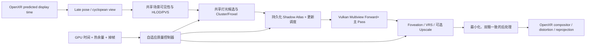

# Zevy VR 一体机渲染优化参考手册

> 文档状态：已实现里程碑、架构复盘与长期研究路线；每项状态以正文证据标记为准
> 目标平台：Android VR 一体机，OpenXR + Vulkan，PICO/Quest 级移动 SoC  
> 目标引擎：高性能、现代 PBR、动态多灯光、动态阴影、稳定双眼输出  
> 资料校正日期：2026-07-20
> 当前项目基线：Bevy 0.16.1、wgpu 24、`bevy_mod_openxr` 0.3 的本地修改版；上游对照为 Bevy 0.19 与 wgpu 30

本文把本目录的四张网页截图作为术语和历史背景，并结合 OpenXR 1.1、Vulkan 1.1+、现代移动 tile-based GPU、2025 年多灯光研究以及 Zevy 当前代码状态进行重新推导。截图中的 Unity、OpenGL ES 和厂商 SDK 结论不能直接等同于 Zevy 的 Vulkan/Bevy 实现。

证据标记：

- **[规范]**：Khronos、OpenXR、Vulkan 等正式规范。
- **[供应商]**：Android、Arm、Qualcomm 等官方工程建议。
- **[研究]**：论文或公开技术课程，应通过目标设备复测。
- **[Zevy 现状]**：当前工作区代码能够直接确认的行为。
- **[设计假设]**：值得试验的 Zevy 方向，尚未在目标 VR 设备上证明。

---

## 1. 执行摘要：先确定引擎哲学

VR 一体机渲染不是桌面渲染的低画质版本。它同时受到双眼、高刷新率、移动 GPU 带宽、统一内存、散热、跟踪延迟和镜片畸变约束。真正可持续的现代 VR 渲染器应遵循以下原则：

1. **稳定性优先于峰值画质。** 目标是热稳定后的 P95/P99 帧时间，而不是冷机时的平均 FPS。
2. **双眼只在必须不同的地方不同。** 阴影、可见性、灯光候选、材质数据和命令编码应尽量共享；最终投影与片元结果才按眼睛区分。
3. **动态灯光不等于所有灯每像素计算，也不等于所有灯每帧更新阴影。** 灯光外观、直接光照、阴影分辨率和阴影更新频率必须解耦。
4. **优先减少像素、带宽和外部内存往返。** 一体机通常比三角形吞吐更早受到 fragment、attachment bandwidth 和热功耗限制。
5. **优化顺序是结构复用、感知复用、时间复用，最后才是牺牲正确性。** 先做 Multiview、tile-local、缓存和 foveation，再考虑删灯、删阴影或明显降低画质。
6. **框架边界不是产品边界。** Bevy、wgpu、Naga、OpenXR 插件、渲染图和 Vulkan backend 都允许 fork、修改或替换；插件层实现只是手段，不能成为限制架构突破的教条。

推荐的长期基线是：

> **Vulkan Multiview + 移动端 Forward+/Clustered Forward + 持久化阴影 Atlas + 阴影更新预算调度 + Foveated Rendering + 热稳定自适应质量。**

灯光数量进一步扩大时，推荐研究：

> **确定性关键灯光 + 双眼共享的随机长尾灯光采样 + 解耦低频阴影项。**

不建议把完整桌面 Deferred、Virtual Shadow Maps、逐像素 ReSTIR 或硬件光追直接指定为第一代一体机公共基线。这不是研究禁令：它们以及 software BVH、tile-local deferred、稀疏 shadow page 等路线都应允许隔离原型和真机竞赛；只有证据不足的方案不能未经验证成为最低公共路径。

---

## 2. 对提供截图的现代化校正

本目录资料：

- [doc1.png](./doc1.png)：Unity OpenXR Multi Pass 与 Single Pass Instanced。
- [doc2.png](./doc2.png)：Multi-Pass、Single-Pass、Multiview 与 Quad-View。
- [doc3.png](./doc3.png)：较早期 OpenGL ES `OVR_multiview`、multi-viewport 和 w-scaling。
- [doc4.png](./doc4.png)：Unity 各种立体渲染模式总结。

### 2.1 仍然成立的结论

- Multi-Pass 通常会重复相机级 CPU 工作、draw 编码、状态切换和一部分 GPU 工作。
- 双眼主渲染目标通常应使用二维数组纹理，每个 layer 对应一个 view。
- Shader、后处理、屏幕空间 UV、历史缓冲和 motion vector 都必须识别 view index。
- Single-Pass/Multiview 的兼容性问题是真实的，尤其是自定义后处理和第三方 Shader。
- Quad-View/Foveated Inset 可以把高像素密度集中在注视区域，但不是所有运行时都支持。

### 2.2 必须纠正的常见说法

| 历史说法 | 现代解释 |
|---|---|
| Single Pass 只“渲染一次” | 更准确地说，是记录/提交一组命令并写入多个 view layer；两个眼睛的像素仍然需要产生。 |
| Single Pass 会让 GPU 成本减半 | 它主要降低 CPU、驱动和状态开销，并可能复用部分几何工作；fragment 成本通常不会减半。 |
| Instancing 与 Multiview 完全不同 | 在 Vulkan 中应优先讨论 `VK_KHR_multiview`/Vulkan 1.1 Multiview；底层实现可由硬件自由优化。 |
| Quad-View 是某一厂商专用模式 | OpenXR 1.1 已定义 `PRIMARY_STEREO_WITH_FOVEATED_INSET` 四视图配置，但运行时支持仍是可选的。 |
| Foveation 就是降低整个纹理分辨率 | Foveation 可以通过运行时 foveation、fragment shading rate、fragment density map 或四视图实现，节省的阶段不同。 |
| MSAA 2x 就会让 fragment shader 执行两次 | 默认逐像素着色时未必如此，但覆盖、深度和颜色样本存储仍会增加；开启 sample shading 后才更接近逐样本着色。 |

Vulkan Multiview 已进入 Vulkan 1.1 核心，其目标就是用一组命令对多个 view 执行略有差异的渲染。[Vulkan `VK_KHR_multiview` 参考](https://docs.vulkan.org/refpages/latest/refpages/source/VK_KHR_multiview.html)

OpenXR 1.1 的四视图配置由两个外围 view 和两个 foveated inset view 构成，但应用必须先枚举运行时支持，不能假定 PICO、Quest 或其他设备都提供相同扩展。[OpenXR 1.1 最新完整规范](https://registry.khronos.org/OpenXR/specs/1.1/html/xrspec.html)

---

## 3. Zevy 当前渲染路径审计

这部分是制定路线的起点，不是最终架构。

| 项目 | 当前状态 | 影响 |
|---|---|---|
| 图形 API | Android Vulkan + OpenXR | 方向正确，可使用 Vulkan 1.1 Multiview，但仍需查询设备能力。 |
| 立体渲染 | OpenXR 插件创建两个独立 `XrCamera`，分别指向 swapchain array layer | **当前本质上是 Multi-Pass。** |
| Bevy Pipeline | 本地 Bevy 0.16.1 的 pipeline cache 把 wgpu `multiview` 固定为 `None` | Multiview 不是简单配置项，需要修改引擎渲染层或升级；这不再被视为禁区。 |
| GPU-driven | XR 相机带有 `NoIndirectDrawing` | 当前关闭 Bevy GPU transform/culling/indirect 路径，CPU 和 draw 扩展性受到限制。 |
| XR 分辨率 | `RenderQualityConfig.xr_render_scale = 0.8` | 每眼宽高 0.8，理论像素为推荐分辨率的 64%。 |
| MSAA | `msaa_samples = 2` | 是移动 VR 的合理起点，仍须实测带宽和边缘质量。 |
| 灯光分簇 | Map_S03B 已从 `ClusterConfig::Single` 迁移到可配置 Clustered Forward，并叠加固定预算 Scalable Point Lighting 原型 | 当前每个 shading point 默认完整计算 2 个 Hero + 2 个 Tail；下一步应把候选 PDF 上移到双眼共享 tile/froxel。 |
| 当前 Map_S03B 材质 | 当前目录有 39 个 glTF，均未声明 `KHR_materials_unlit`；静态模型包含 `pbrMetallicRoughness` | 当前测试已经覆盖可受 PointLight 影响的 StandardMaterial/PBR 接收路径，但仍需用 HUD 区分具体材质复杂度。 |
| 阴影 | 当前 Map_S03B 的 16 盏 PointLight 已接入持久化静态 cubemap-array 与动态 caster overlay | 默认公平调度每帧最多更新 2 盏灯，即最多 12 面重绘/84 面复用；动态层只清除并重绘当前或上一帧受动态 caster 影响的 face。尚未完成真实 GPU 毫秒预算调度。 |
| 纹理 | 已有 mip chain、trilinear 和 anisotropic sampler | 方向正确；下一阶段是 ASTC/KTX2、分辨率分级和纹理带宽统计。 |
| 调试 | HUD 已显示 triangles、draw 估算、fragment、pass 和材质信息 | 应继续加入每 cluster 灯数、阴影 texel 更新量、热状态和双眼实际 GPU 时间。 |

当前 OpenXR 双相机循环可见于 [`render.rs`](../third_party/crates/bevy_mod_openxr-0.3.0/src/openxr/render.rs)，质量配置可见于 [`config.rs`](../src/config.rs)，Map_S03B 的分簇、灯光和阴影更新策略可见于 [`scene.rs`](../src/scene.rs)，持久化缓存节点可见于 [`shadow_cache.rs`](../src/shadow_cache.rs)。

### 3.1 对当前测试结果的正确解释

Map_S03B 测得：

- `Triangles / eye ≈ 208,989`，随镜头远近基本不变：当前没有有效 LOD。
- `Fragment invocations` 随画面覆盖率大幅变化，并与帧率强相关：当前更像 fill-rate/带宽瓶颈。
- VR fragment 大约是 PC 的两倍：符合双眼独立渲染预期。
- 当前重新导出的静态模型不再声明 `KHR_materials_unlit`，并包含 glTF PBR 材质；当前 fragment 成本已经混入动态灯光/PBR 工作，必须通过 shadow-off、direct-off 和 material tier A/B 继续拆分。

因此最近的 0.8 Scale 与 MSAA 2x 是正确的诊断方向，但长期引擎不能止步于统一降分辨率。

### 3.2 16 盏动态灯光里程碑复盘（2026-07-20）

Map_S03B 已在 VR 一体机上同时运行 16 盏 PointLight，全部保持直接光和阴影驻留，火光强度、发光体以及阴影投影都能动态变化。实机约 20 FPS，阴影变化存在明显阶梯感。这个结果是一个重要的**可行性突破**，但还不是“高性能渲染器完成”：20 FPS 对应约 50 ms/frame，而 72 Hz 和 90 Hz 的帧预算分别只有 13.89 ms 与 11.11 ms，仍需约 3.6 倍和 4.5 倍的结构性提速。

当前阴影阶梯感可以直接由预算解释。16 盏灯目标 8 Hz、每帧最多更新 2 盏时，在 20 FPS 下每盏灯的长期上限为：

\[
f_{shadow}=\min\left(8,\frac{20\times2}{16}\right)=2.5\ \text{Hz}
\]

即一次完整轮转约 400 ms。调度器现在能保证公平、不会再冻结某几盏灯，但公平调度只能分配稀缺预算，不能凭空创造 GPU 时间。若仍用真实移动 PointLight 重画静态建筑的六面 cubemap，要维持 16 灯 × 8 Hz，在 20 FPS 下至少需要每帧更新：

\[
B=\left\lceil\frac{16\times8}{20}\right\rceil=7\ \text{lights/frame}=42\ \text{faces/frame}
\]

这说明下一步不能只继续增大 `max_cached_point_shadow_updates_per_frame`，而必须降低一次投影更新的成本，或让视觉上的连续运动不再依赖每次重画六面深度。

#### 3.2.1 已经形成的突破性方案

| 突破 | Zevy 已做的事情 | 为什么重要 | 尚未解决 |
|---|---|---|---|
| 灯光物理范围与相机可见性解耦 | 修复 XR infinite reverse-Z 下错误的灯光远裁剪，保持约 6 m 物理照射范围，同时让远处相机仍能看到墙面受光 | 消除了“靠近才突然亮”的非物理行为，没有用扩大 `light.range` 掩盖问题 | 仍需设备级 cluster/visibility telemetry |
| 正常 Clustered Forward 候选生成 | 从单一全屏 cluster 迁移到可配置 froxel | 灯光候选由空间相交决定，灯数可以扩展 | Bevy 0.16 的 clustering 与双眼仍有重复，缺少 overflow 观测 |
| 固定昂贵成本的 Hero + Tail 光照 | 直接替换 Bevy PBR PointLight 循环；每像素保留 2 个确定性 Hero 与 2 个重要性采样 Tail | 完整 BRDF + shadow lookup 从随候选灯数增长，变为默认最多 4 次 | 选灯仍在每个片元扫描候选列表，尚未达到真正固定总成本 |
| 阴影驻留与相机距离解耦 | 所有关卡启用阴影的 PointLight 常驻，`max_shadowed_point_lights = 0` 自动跟随导入灯数 | 16 盏灯不会因玩家移动突然丢失或出现阴影 | 常驻不等于便宜，96 个静态 face 仍有 view 管理成本 |
| 真正的跨帧阴影内容缓存 | 不只是复用 texture object，而是有效 layer 完全跳过 clear、render pass 和 shadow draw | 静态建筑不再为所有灯每帧重复 raster | 当前仍较晚才跳过 pass，前置 visibility/queue 工作仍可能发生 |
| `Static × Dynamic` 双层阴影 | 静态建筑进入持久层，动态 caster 进入独立 overlay，PBR 中执行 `Vstatic × Vdynamic` | 少量动态物体不再使整座建筑的静态阴影失效 | 动态层激活时仍为所有灯预留对称 cube 空间，尚未稀疏分页 |
| 无额外材质绑定的 atlas 编码 | 用 static/dynamic cube-array 的偶奇性与 sentinel 让 shader 识别双层布局 | 在 Bevy 既有 PBR bind group 约束下完成了双层合成 | 这是兼容性技巧，不应阻止未来重做 bind layout |
| XR 阴影跨眼复用 | 相同 `(light, face)` 用原子 claim 去重，左右眼共享 light-space depth | 阴影不是 eye-dependent 数据，避免双眼重复提交相同 pass | 主场景渲染仍是双相机 Multi-Pass |
| 无饥饿阴影调度 | 从未更新优先，其余 oldest-first；低帧率时所有灯公平轮转 | 预算不足只降低整体更新频率，不再永久冻结后排灯 | 固定“灯/帧”不是 GPU 毫秒预算，也没有视觉误差模型 |
| VR 内可观测性 | HUD 显示 FPS、fragment、draw/triangle 估算、pass、材质、阴影 redraw/reuse、动态 caster | 优化从猜测变成可证伪实验 | Android 真 GPU pass 时间、cluster occupancy、thermal 尚不完整 |

真正的共同突破不是某个单独技巧，而是把一个“动态灯”拆成了彼此独立的预算维度：

\[
Light = Visibility + DirectLighting + StaticDepth + DynamicDepth + UpdateRate + FilterQuality
\]

因此“灯必须同时可见”不再等于“每盏灯每像素完整计算、每帧重画六面阴影”。这套解耦是 Zevy 后续扩展到更多灯的核心资产。

#### 3.2.2 仍然保守或只是过渡的做法

| 保守边界 | 当前代价 | 下一步应如何打破 |
|---|---|---|
| 固守 Bevy 0.16.1 / wgpu 24 | 错过上游 GPU light clustering、GPU-driven 改进、render schedule 重构和新版 Multiview 基础 | 并行评估升级 Bevy 0.19、选择性回移上游优化、维护 Zevy 引擎 fork；以实机结果决定，不以迁移工作量否决 |
| XR 两个独立 Camera/Multi-Pass | 重复 view extraction、culling、draw encoding、状态和几何工作；fragment 本来就近似双倍 | 修改 Bevy/wgpu/OpenXR 渲染链，建立真正的 layered Multiview 主 Pass 与 Cyclopean culling |
| XR 相机使用 `NoIndirectDrawing` | 无法充分使用 GPU culling、batching 与 multi-draw indirect | 修改 XR render target/phase 兼容性，恢复并验证 GPU-driven 路径 |
| Hero/Tail 在每个片元选灯 | 虽然完整 BRDF 固定为 4 次，但 Hero 扫描、Tail 求和和每个样本查找仍约为 \(O((K+2)N)\) | 把候选重要度、Hero 和 reservoir/alias table 上移到双眼共享 tile/froxel，只把紧凑 ID 列表交给片元 |
| 16 盏都用 PointLight cubemap | 每次真实更新固定六个 face，灯型表达也未必符合壁灯/烛台 | 尝试 cubemap 六面 Multiview、dual-paraboloid、Spot proxy、octahedral/software raster 与共享 BVH visibility |
| 5 mm 火光摇摆也重画静态建筑 | 很小的视觉变化会使该灯六个静态 face 全部失效，造成 2.5 Hz 阶梯 | 默认冻结 nominal static depth，在 shader 中连续驱动 PCF/cookie/微扰；真实移动阴影改为关键帧双采样或只给 Hero |
| 动态 overlay 使用对称双倍 cube-array | 只有少量 `(light, face)` 受动态 caster 影响时仍扩展整套 atlas | 做稀疏 dynamic page、face indirection 与按影响关系分配 |
| 固定 128²、固定灯/帧预算 | 简单稳定，但没有利用屏幕误差、caster 数和真实 GPU 成本 | 建立 per-face cost EMA、误差/年龄优先级和 GPU-ms token bucket |
| 没有 LOD/HLOD/PVS | 远近三角形基本不变，阴影 caster 与主视图都承担多余几何 | UE 导出 LOD、room/portal/PVS、shadow-only LOD，并恢复 GPU visibility range |
| 统一 render scale 0.8 + MSAA 2x | 是有效但粗粒度的 fill-rate 降级，中央与外围一起损失 | 优先接入运行时 foveation/VRS、periphery material tier 和 tile-local attachment 优化 |

截至 2026-07-20，上游 [Bevy 0.19](https://bevy.org/news/bevy-0-19/) 已把 light clustering 搬到 GPU，并继续增强 GPU-driven batching；其官方 `many_lights` 基准报告 clustering 有数量级改进，但该结果不能直接外推到 Android VR，必须在 Map_S03B 上复测。新版 [wgpu Multiview](https://github.com/gfx-rs/wgpu/releases/tag/v28.0.0) 已增加跨后端验证和 view bitmask。它们共同证明：当前 0.16.1 的限制是项目选择，不是图形 API 的物理边界。

结论是：下一阶段不能以“尽量不动 Bevy 源码”为目标。正确目标是让每一个架构假设都接受数学模型、GPU capture 和目标设备 A/B 的检验；必要时 fork Bevy、wgpu、Naga、XR 插件，甚至绕过现有 PBR/shadow pipeline 建立 Zevy 专用移动 VR 路径。

---

## 4. 一体机硬件模型：为什么桌面经验经常失效

### 4.1 Tile-Based Rendering

移动 GPU 通常把画面划分为 tile，先 binning，再让每个 tile 在片上高速存储中完成颜色、深度和混合，最后才写回统一内存。性能核心不是“有多少显存”，而是：

- attachment 是否能停留在 tile memory；
- render pass 边界是否迫使中间结果写回 RAM；
- load/store 是否明确允许丢弃无用数据；
- 是否出现全屏 ping-pong、宽 G-buffer、大量 barrier 或 compute/image 往返；
- fragment shader 是否产生高寄存器压力、分支发散和不连续纹理读取。

Khronos 的现代 TBR 指南强调保留 tile-local 数据、精确 load/store、保持 early-Z、减少宽 barrier，并指出 tile 大小是硬件细节，不应在跨平台引擎中硬编码。[Khronos Tile-Based Rendering Best Practices](https://docs.vulkan.org/guide/latest/tile_based_rendering_best_practices.html)

### 4.2 统一内存与带宽

CPU、GPU、相机、系统合成器和跟踪系统共享内存带宽。一个“只是多一次全屏 pass”的桌面优化，在一体机上可能同时增加：

- attachment 写出；
- 下一 pass 的纹理读取；
- cache eviction；
- 功耗和温度；
- compositor 等待时间。

### 4.3 热稳定性能

一体机的峰值 GPU 频率不能长期保持。高温后，CPU/GPU 降频会导致本来稳定的 90 FPS 突然进入重投影或降帧状态。Android 官方建议使用 Thermal API/ADPF 预测热余量并主动降低 framebuffer、线程或画质，而不是等待系统节流。[Android ADPF](https://developer.android.com/games/optimize/adpf)、[Thermal API](https://developer.android.com/games/optimize/adpf/thermal)

设计目标必须同时满足：

\[
T_{GPU,P99} < T_{app\_budget}, \quad
T_{CPU,P99} < T_{app\_budget}, \quad
P_{sustained} < P_{thermal}
\]

在刷新率为 \(f\) 时，每帧可持续能量近似为：

\[
E_{frame,max} = \frac{P_{sustained}}{f}
\]

从 72 Hz 提升到 90 Hz，每帧可使用的能量只有原来的 \(72/90=0.8\)。因此 90 Hz 不只是帧时间缩短 20%，也是每帧热预算减少 20%。

---

## 5. 数学预算模型

### 5.1 刷新率与帧时间

| 刷新率 | 显示周期 | 建议应用 GPU 初始目标 | 备注 |
|---:|---:|---:|---|
| 72 Hz | 13.89 ms | 10.5～11.5 ms | 画质/热稳定模式。 |
| 80 Hz | 12.50 ms | 9.5～10.5 ms | 设备支持时的折中。 |
| 90 Hz | 11.11 ms | 8.0～9.0 ms | 推荐的高性能目标，给 runtime/compositor 留余量。 |
| 120 Hz | 8.33 ms | 5.8～6.8 ms | 只适合显著简化的场景和高端设备。 |

这里的应用预算不是规范要求，而是保守起点。CPU 与 GPU 可以并行，不能简单相加；最终以 OpenXR 实际 frame timing 和设备重投影状态为准。

### 5.2 双眼像素预算

设每眼分辨率为 \(W\times H\)，view 数为 \(V\)，线性 render scale 为 \(s\)：

\[
P_{target}=VWHs^2
\]

例如每眼 1920×1920、双眼：

\[
P_{1.0}=2\times1920^2=7.37\text{ M pixels/frame}
\]

Scale 0.8 后：

\[
P_{0.8}=P_{1.0}\times0.8^2=4.72\text{ M pixels/frame}
\]

这就是为什么 0.8 不是“只省 20%”，而是理论上少 36% 的目标像素。

片元工作可以粗略写为：

\[
F \approx P_{target}\times O\times K\times q
\]

其中：

- \(O\)：不透明与透明 overdraw；
- \(K\)：执行 fragment 的 pass 数；
- \(q\)：平均 shading rate，完整分辨率为 1，2×2 VRS 理想情况下接近 1/4；
- MSAA 的覆盖/存储成本应单独计算，不能简单并入 fragment invocation。

建议 HUD 派生指标：

\[
R_{frag}=\frac{FragmentInvocations}{P_{target}}
\]

它不是严格 overdraw，因为 GPU query 可能聚合多个 pass，而且 early-Z、sample shading 和驱动实现会影响统计；但同一设备、同一构建中的相对变化非常有价值。

### 5.3 Attachment 带宽上界

近似外部内存流量：

\[
B_{frame}\approx\sum_i P_i\,m_i\,b_i\,(L_i+S_i)
\]

- \(m_i\)：MSAA 样本数；
- \(b_i\)：attachment 每样本字节数；
- \(L_i,S_i\)：是否从外部内存 load/store；
- tile memory、压缩、transient attachment 和 `DONT_CARE` 会显著降低实际值。

仍以双眼 1920×1920 为例，如果主 pass 使用 RGBA16F（8 B）和 D32（4 B），2x MSAA 的单次完整颜色+深度样本量约为：

\[
7.37\text{ M}\times12\text{ B}\times2=176.9\text{ MB/frame}
\]

如果这些数据每帧都完整流经外部内存，90 Hz 上界约 15.9 GB/s。Scale 0.8 后约 10.2 GB/s。这还没有计算纹理、shadow map、历史缓冲和后处理，因此必须尽量让主 pass 在 tile 内完成并丢弃不需要的 attachment。

### 5.4 几何吞吐

粗略三角形吞吐：

\[
R_{tri}=N_{tri/view}\times V\times f
\]

Map_S03B 的 208,989 triangles/eye 在 90 Hz 双眼下约为：

\[
208,989\times2\times90=37.6\text{ M triangles/s}
\]

该数量不一定立即成为瓶颈，但没有 LOD 意味着它不会随距离下降。Multiview 也不保证两个 eye 的 vertex shader 只运行一次；它主要保证命令复用，并允许硬件自行优化。

### 5.5 基于投影误差的 LOD

不要只用世界距离切 LOD。若模型简化误差为 \(e_w\)，到相机距离为 \(z\)，垂直分辨率为 \(H\)，垂直 FOV 为 \(\theta\)，屏幕误差近似：

\[
e_{px}=\frac{e_w H}{2z\tan(\theta/2)}
\]

当 \(e_{px}\) 低于阈值时切换到更低 LOD。VR 中左右眼应选择两眼需求的较高者，并加入 hysteresis，禁止双眼或连续帧在 LOD 边界抖动。

### 5.6 多灯光复杂度

朴素 Forward 的片元灯光成本：

\[
C_{forward}\propto\sum_{p\in pixels}|L(p)|
\]

如果一个全屏 cluster 塞入全部灯光，则近似变成：

\[
C\propto P_{target}\times N_{lights}
\]

Clustered Forward 将屏幕和深度切成 froxel：

\[
C_{clustered}\approx C_{assign}+\sum_p |L(cluster(p))|
\]

深度切片建议使用对数分布：

\[
z_i=n\left(\frac{f}{n}\right)^{i/N_z}
\]

这样近处切片不会太厚，远处也不会产生极长 cluster。16×16 或 32×32 screen tile、16～24 个 Z slice 可以作为起始实验值，不应成为硬编码结论。

Clustered Shading 的原始研究表明，加入深度和法线信息可以显著减少无效灯光计算，并改善高深度不连续场景的最坏情况。[Clustered Deferred and Forward Shading](https://diglib7.eg.org/items/6342d4d6-5220-4376-a5c6-a153058f4a3c/full)

### 5.7 阴影成本

阴影更新成本近似为：

\[
C_{shadow}\approx\sum_l u_l F_l\left(G_l+kR_l^2\right)
\]

- \(u_l\)：该灯本帧是否更新，或平均更新频率；
- \(F_l\)：spot 通常 1，point cubemap 通常 6，directional 为 cascade 数；
- \(G_l\)：shadow caster 几何成本；
- \(R_l\)：shadow map 边长；
- \(k\)：raster、store 和 filtering 的综合系数。

对一体机而言，最有效的变量往往不是继续降低 \(R_l\)，而是先把 \(u_l\) 从 1 降为按事件或按预算更新。

### 5.8 感知误差目标

VR 优化不能只最小化像素误差。建议把质量损失写为：

\[
E=w_cE_{center}+w_pE_{periphery}+w_tE_{temporal}+w_bE_{binocular}
\]

- 中央视野误差 \(E_{center}\) 权重高于外围；
- 时间闪烁/拖影 \(E_{temporal}\) 通常比静态轻微模糊更令人不适；
- 左右眼不一致 \(E_{binocular}\) 应给予最高惩罚之一。

因此，宁可让双眼外围同时轻微变糊，也不要让左右眼随机选择不同灯光、阴影或 LOD。

---

## 6. 推荐的目标渲染架构

### 6.1 五种复用

这是 Zevy 可以形成差异化的核心设计语言：

1. **双眼复用**：一次 culling、一次 draw 编码、共享 light list、共享 shadow map。
2. **空间复用**：tile/cluster 内共享灯光候选、材质数据和阴影结果。
3. **时间复用**：静态 shadow cache、低频更新、历史稳定性。
4. **感知复用**：foveation、外围低 shading rate、独立高清 UI layer。
5. **语义复用**：关键灯保持确定性；装饰灯、远灯和次要阴影采用低成本近似。

任何新特性都应回答：它复用了什么？如果它只是增加一个全屏 pass 或一套历史缓冲，就必须证明收益大于带宽和延迟成本。

---

## 7. 立体渲染：从当前 Multi-Pass 走向 Vulkan Multiview

### 7.1 模式比较

| 模式 | CPU 提交 | GPU 几何 | Fragment | 兼容性 | 建议 |
|---|---:|---:|---:|---|---|
| Multi-Pass | 近似按 view 重复 | 按 view 重复 | 按 view 重复 | 最好 | 调试与兼容 fallback。 |
| Double-Wide Single-Pass | 命令可部分共享 | 仍有双眼工作 | 双眼像素 | 后处理易出错 | 历史方案，不作为新架构目标。 |
| Instanced Stereo | 一次 draw、实例区分 eye | 实现相关 | 双眼像素 | Shader 要识别 eye | 可用，但 Vulkan 更应直接看 Multiview。 |
| Vulkan Multiview | 一组命令写多个 layer | 由硬件优化 | 双眼像素 | 需 pipeline、Shader、pass 全链支持 | Zevy 长期基线。 |
| Quad/Foveated Inset | 2 或 4 view | 额外 view 工作 | 可显著减少外围像素 | 运行时可选 | 高端能力层。 |

### 7.2 Multiview 实际能省什么

优先收益：

- draw command encoding；
- pipeline/state 设置；
- CPU 到驱动的调用；
- per-view resource binding；
- 某些 GPU 上的顶点获取和几何调度；
- 更容易共享一个 layered depth/color pass。

不能指望它自动节省：

- 双眼目标像素；
- PBR fragment shader；
- 每眼屏幕空间后处理；
- 需要不同 view-space 数据的计算。

### 7.3 Zevy 的实现障碍

[Zevy 现状] wgpu 24 已有 render pipeline 的 `multiview` 字段，但 Bevy 0.16.1 的 pipeline cache 当前固定为 `None`。因此不能只把两个相机改成一个相机；至少需要：

- layered color/depth view；
- render pass view mask；
- pipeline multiview count；
- Shader 中的 view index；
- 两套 view/projection uniform；
- PBR、shadow receiver、fog、UI、post-process 全链验证；
- 对不支持或存在驱动问题的设备保留 Multi-Pass fallback。

### 7.4 双眼共享可见性

CPU 可用一个包含左右眼 frustum 的 conservative union frustum 做第一次粗裁剪，再为每眼做很轻的精裁剪。室内场景还应在此之前使用 room/portal/PVS，避免整个关卡进入双眼可见集。

### 7.5 Late Latching 与预测姿态

相机姿态应尽可能接近提交时根据 OpenXR predicted display time 更新。不要为了多线程提前很多毫秒冻结 eye matrix。Multiview 共享 draw list，但左右眼 view matrix 必须保持与同一 predicted time 一致。

---

## 8. 移动 VR 的主渲染路径：Forward+ 优先

### 8.1 为什么不是完整 Deferred

完整 Deferred 的优势是材质与灯光解耦，但移动 VR 的代价是：

- 多个宽 G-buffer attachment；
- 双眼和 MSAA 放大存储；
- G-buffer 写回/读取的外部带宽风险；
- 透明和特殊材质仍需额外 forward；
- 多个 pass 增加 latency 和 barrier。

因此推荐 Forward+/Clustered Forward 作为通用基线：

- 原生支持 MSAA；
- PBR、透明和自定义材质统一；
- G-buffer 更少；
- 对 tile GPU 更容易保持主颜色和深度在片上；
- 灯光数量由 cluster list 控制，而不是固定每物体灯数。

### 8.2 何时考虑 Tile-Local Deferred

只有满足以下条件时才值得实验：

- 设备能把 G-buffer subpass 合并并保留在 tile memory；
- attachment 数量和格式很窄；
- 大量材质共享统一 lighting pass；
- MSAA 成本可接受；
- AGI/厂商 counter 证明没有发生外部 G-buffer round-trip。

Arm/Khronos 的移动 Vulkan 案例表明，成功的 subpass merging 可以大幅减少 G-buffer 读写，但这依赖设备和 render pass 结构，不能仅凭 API 形式推断。[Arm/Khronos Vulkan Samples](https://developer.arm.com/community/arm-community-blogs/b/mobile-graphics-and-gaming-blog/posts/vulkan-samples)

### 8.3 Cluster 配置原则

- 不使用整个视图一个 `ClusterConfig::Single` 作为多灯光通用路径。
- 以屏幕 tile + 对数 Z slice 建立 froxel。
- 对 PointLight 使用 sphere-vs-froxel，对 SpotLight 使用 cone-vs-froxel。
- cluster list 需要 overflow 统计；不能静默丢弃灯光。
- cluster far plane 应覆盖“能影响可见表面”的范围，而不是只按灯中心到相机距离。
- 灯的物理 `range` 是照明截止半径，不是“相机能看见灯”的距离。

### 8.4 Cyclopean Cluster：双眼共享灯光列表

**[设计假设]** 左右眼 frustum 高度重叠，可以用头部中心的 cyclopean view 建立共享 froxel，或用双眼投影包围体扩大 tile 边界：

- 优点：light assignment 只做一次；左右眼使用一致的候选灯光；缓存更友好。
- 代价：近距离和画面边缘会出现 conservative false positive，每 cluster 灯数略高。
- 保护措施：近场物体或极宽 FOV 可回退到 per-eye 精细列表；必须统计平均/最大 lights per cluster。

共享 cluster 也可统一承载 decals、reflection probes、fog volumes 和局部环境探针，使空间查询成本集中到一次。

---

## 9. 高数量动态灯光：确定性主干 + 随机长尾

### 9.1 第一阶段：完全确定性的 Clustered Forward

在几十个可见局部灯以内，首先使用完全确定性列表：

- 每个 cluster 保存所有真正相交的灯；
- 按灯类型分组，减少 shader divergence；
- 关键灯优先放在连续内存；
- 对非常弱的灯使用基于最大可能照度的 conservative 剔除；
- 设置“每 cluster 软预算”而不是硬截断。

物理量可帮助排序。各向同性 PointLight 的光通量为 \(\Phi\) 流明时，近似光强：

\[
I_v=\frac{\Phi}{4\pi}\quad(\text{candela})
\]

距离 \(d\) 处照度：

\[
E(d)=\frac{I_v}{d^2}
\]

实际实时渲染应使用平滑 cutoff，避免 `range` 边缘突然消失。例如：

\[
a(d)=\frac{\max(1-(d/R)^4,0)^2}{\max(d^2,\epsilon)}
\]

`range=R` 只定义物理影响截止，发光模型的 emissive 可视距离应由普通 mesh culling 独立控制。

### 9.2 第二阶段：关键灯与长尾灯分离

当一个 cluster 中有太多灯时，不应简单取最近 N 个，因为会造成灯光 popping 和能量丢失。建议：

- **Hero/Deterministic set \(H\)**：太阳、手电、剧情灯、最近的强灯、会产生明显阴影的灯，每像素稳定计算。
- **Tail set \(T\)**：装饰灯、远灯、弱灯、重复烛火，通过 tile 级 importance sampling 选择少量样本。

简化的无偏估计：

\[
\hat L(x)=\sum_{l\in H}f_l(x)+\frac{1}{K}\sum_{i=1}^{K}\frac{f_{s_i}(x)}{p(s_i)}
\]

其中 \(p(l)\) 可按投影影响、亮度、BRDF 上界和粗略可见性构建：

\[
p(l)\propto Y_l\,A_{screen,l}\,B_{max,l}\,V_{approx,l}
\]

### 9.3 双眼一致随机采样

**这是 VR 特有的硬要求。** 不要让左右眼独立随机选灯，否则可能出现左右眼亮度、阴影和高光不一致。

建议：

- 从 cyclopean tile/froxel 产生同一组 light sample/reservoir；
- 左右眼共享 light ID 与随机序列；
- 每眼仍使用自己的 position、normal、BRDF 和 shadow coordinate 评估；
- Hero lights 永远确定性；
- 随机噪声使用世界空间或头中心稳定 seed，避免转头时噪声粘在屏幕上；
- 时间累计要短、保守，优先稳定而不是追求桌面式长历史收敛。

### 9.4 为什么这个方向值得研究

SIGGRAPH 2025 的 Stochastic Tile-Based Lighting 将采样从逐像素移动到 tile，使用两阶段 reservoir，在小 tile 中只保留固定 1～4 个灯，并把阴影评估从最终 lighting shader 解耦。公开结果显示该算法在 Adreno 610/830 上能以接近固定的成本处理很多局部灯，但它仍是带噪声、依赖重建的研究型方案，数据不能直接当作 Zevy 性能承诺。[Stochastic Tile-Based Lighting 2025](https://advances.realtimerendering.com/s2025/content/s2025_stb_lighting_v1.1_notes.pdf)

Zevy 可以采用更保守的混合版本：

1. 先实现完全确定性的 Clustered Forward。
2. 仅在 cluster overflow 时采样长尾。
3. 关键灯和近场灯永不随机。
4. 两眼共享样本。
5. 先不依赖长历史 TAA，必要时增加 K 而不是强行去噪。

这能把创新风险隔离在 overflow 路径，不破坏普通场景的确定性。

### 9.5 UE5 MegaLights：借鉴目标，而不是移植实现

Epic 当前 MegaLights 是一条统一的随机直接光照路径：它对重要灯光做 importance sampling，每个像素只使用固定数量的样本/可见性射线，并用 denoiser 从带噪结果重建最终照明。传统 Deferred 的灯数增加会增加 GPU 成本；MegaLights 则更接近固定成本，但同一像素上竞争的重要灯越多，噪声、模糊和 ghosting 风险越高。[Epic MegaLights 技术文档](https://dev.epicgames.com/documentation/en-us/unreal-engine/megalights-in-unreal-engine)

它从另一个方向验证了本章的核心判断：真正可扩展的多灯光系统应限制“每个 shading point 实际评估多少灯”，而不是只限制场景灯光总数。

#### 9.5.1 不能直接移植的原因

Epic 明确说明当前 MegaLights：

- 面向本世代主机和支持 Ray Tracing 的 PC；
- 不支持 mobile；
- 与 UE Forward Renderer 不兼容；
- 默认用共享 Ray Tracing Scene/BVH 评估阴影，也可选择逐灯生成 Virtual Shadow Map；
- 依赖随机采样、screen-space trace、ray guiding 和 denoising 的完整链路。

Zevy 的公共路径是移动 VR、Forward+、双眼、tile-based GPU，且不能假定存在可持续的硬件光追。因此不能照搬“Deferred + 每像素 ray + 重型 denoiser”，但可以吸收其预算模型、importance guiding、统一调试和 GPU-driven 灯光管理。

#### 9.5.2 有价值的对应关系

| MegaLights 思路 | Zevy 移动 VR 适配 |
|---|---|
| 固定 samples/rays per pixel | 固定 Hero 灯数 + 每 tile/froxel 固定长尾样本数。 |
| Ray-guided importance sampling | 亮度、投影面积、BRDF 上界、粗可见性和剧情权重共同决定采样概率。 |
| 统一直接光照 pass | Forward+ 主 pass 统一读取 cluster 候选、shadow visibility 和 PBR 数据。 |
| 一个 BVH 服务所有灯光阴影 | 持久化 shadow atlas + static cache + dynamic overlay；高端设备再增加可选 ray query。 |
| 简化 Nanite RT scene / Far Field HLOD | Shadow LOD、室内 PVS、简化 occluder 与 HLOD shadow caster。 |
| 每灯可退出 MegaLights | Hero/Directional/交互灯使用确定性路径，只有长尾进入随机路径。 |
| 下采样倍率和 samples-per-pixel 控制质量 | tile 大小、Hero 数、长尾 K、shadow term 分辨率和短历史长度组成质量档。 |
| Light Complexity / ray visualization | 显示候选灯、权重、可见性、采样概率、cluster overflow 和左右眼一致性。 |

#### 9.5.3 有效灯光数量

MegaLights 的质量取决于同一像素上“有多少盏权重接近的重要灯”，而不是场景总灯数。可把归一化重要度记为：

\[
p_i=\frac{w_i}{\sum_jw_j}
\]

定义有效灯光数量：

\[
N_{effective}=\frac{1}{\sum_i p_i^2}
\]

- 一盏灯占绝对主导时，\(N_{effective}\approx1\)；
- 十盏权重相等的灯同时竞争时，\(N_{effective}=10\)；
- 场景可以有上千盏灯，只要每个 cluster 的 \(N_{effective}\) 很低，采样仍可能稳定；
- 如果 \(K\ll N_{effective}\)，则需要增加样本、扩大 Hero set、合并小灯或接受噪声。

建议将 `effective lights/cluster`、sample variance 和 Hero/Tail 比例加入 Zevy 调试面板。它们比单纯的 `Visible lights` 更能预测随机灯光质量。

#### 9.5.4 灯光 Bounds 仍然重要

固定采样预算并不代表灯光可以无限扩大。MegaLights 仍要求收紧 attenuation range、spot cone、rect-light barn door，并避免把灯放进永远不可见的几何内部；否则被遮挡或无意义的强灯会持续占用样本。

这也再次说明：

- `light.range` 应表达物理影响范围，不能用来解决 emitter 的远距离可见性；
- 发光火焰/灯泡 mesh 的相机可见距离应独立管理；
- 多个密集小灯在视觉允许时可合成 Area Light，减少 \(N_{effective}\)；
- UE 导出格式长期可增加 `importance`、`criticality`、`source_shape`、`shadow_policy`、`update_rate` 和 `sampling_group` 等工程元数据。

#### 9.5.5 阴影成本的关键差异

MegaLights 使用一次构建的共享 BVH 为很多灯提供 visibility，因此 shadowed 与 unshadowed light 的边际成本可以接近。若选择 VSM，它仍需逐灯准备 shadow depth，Epic 也明确指出这会增加 CPU、内存和 GPU 成本。

Zevy 若仍为所有 sampled PointLight 每帧生成六面 cubemap，那么即使最终每像素只抽样两盏灯，也不会得到 MegaLights 式的固定成本。Zevy 的随机长尾必须与以下策略绑定：

1. Hero 灯使用高质量、按需更新的 shadow map。
2. Tail 灯使用持久化低分辨率 cache、无阴影或便宜 visibility proxy。
3. 只为本帧真正需要且缓存失效的灯消耗 shadow update budget。
4. 未来只在高端移动 GPU 上实验少量 ray-query visibility，不能成为公共路径。

#### 9.5.6 VR 特有修正

Epic 文档没有把移动双眼作为 MegaLights 的目标平台。对 Zevy 必须额外要求：

- 左右眼共享 candidate light、reservoir、sample ID 和随机序列；
- Hero 灯完全确定性；
- 每眼只独立计算 view-dependent BRDF、位置和 shadow coordinate；
- 限制长时间 temporal accumulation，优先避免 binocular mismatch 和转头 ghosting；
- 必要时增加 K 或扩大 Hero set，不以重型 denoiser 强行掩盖左右眼不稳定。

因此，最适合 Zevy 的组合不是复制 MegaLights，而是：

> **MegaLights 的固定样本预算与 ray guiding 思想 + Stochastic Tile-Based Lighting 的移动 tile 结构 + Zevy 的 Cyclopean 双眼共享 + 持久化缓存阴影。**

### 9.6 Map_S03B 的 Zevy Scalable Lighting 实验（2026-07-17）

Map_S03B 最初的七灯 Android VR 实测已经说明，“灯数不多”并不等于确定性遍历足够便宜；当前测试又扩展到 16 盏。双眼、高 fragment 数、完整 PBR BRDF 与 cubemap shadow 会把局部灯放大成明显瓶颈。因此工程上提前拉取突破性多灯光路径，在小场景直接验证固定预算模型，而不再把随机长尾限定到几十盏灯之后。

当前实验路径直接替换 Bevy 0.16.1 的 `pbr_functions.wgsl` PointLight 循环：

- 保留正常 Clustered Forward 作为候选灯生成器，不再使用 `ClusterConfig::Single`；
- 阴影驻留与相机距离完全解耦；Map_S03B 当前 16 盏灯的 cubemap shadow 始终启用，不再在玩家靠近时突然出现；
- 每个 shading point 按亮度、距离和 Bevy range attenuation 选择贡献最大的 2 盏灯作为稳定 Hero；
- 其余 PointLight 作为 Tail，不论它是否投射阴影，都进入相同的重要性 PDF；
- 每个 shading point 只完整执行固定 K 次 Tail shadow + BRDF，当前默认 K=2；
- 使用系统分层采样和 `1/(K*p_l)` 权重，保持 Tail 直接光与阴影贡献的估计无偏；
- 当 cluster 候选总数不超过 Hero + Tail 预算时自动回到完全确定性求和，不引入噪声；
- 随机种子使用 12.5 cm 量化世界坐标，同一表面的左右眼尽量选择相同灯；默认关闭时间轮换，使同一表面的 Tail 选择不随帧闪烁；
- 当前 16 盏 PointLight 阴影全部常驻、cubemap 面为 128²，而每个 shading point 的完整 PointLight shadow + BRDF 上限从最多 16 降为 4（2 Hero + 2 Tail）。

这个实验不是完整 STB Lighting，也没有 denoiser/reservoir history。它主动接受以下 trade-off：

- 多盏相似强度 Tail 同时影响同一表面时，可能出现空间分块、低频闪烁或高光方差；
- 世界坐标相关只能提高双眼相关性，不能保证左右眼 cluster 候选列表在 frustum 边缘完全一致；
- 每像素仍需扫描候选灯来构造 PDF；下一步应把 coarse PDF 和候选采样上移到 Cyclopean tile/froxel，供双眼共享；
- 16 盏 PointLight 仍有 96 个常驻 cubemap shadow view；持久化缓存已经消除了稳定 face 每帧重复的 depth clear/raster，但 Bevy 当前仍可能为这些 view 准备 visibility/render phase，CPU 侧还可继续下钻；
- 不允许再次用“相机靠近才打开阴影”作为性能降级策略。低优先级阴影只能降分辨率、降低更新频率并复用缓存，不能在可见画面中突然从无到有。

配置入口为 `RenderQualityConfig.scalable_point_lighting`、`point_light_hero_samples`、`point_light_tail_samples`、`temporal_point_light_sampling` 和 `light_sample_period_frames`。`max_shadowed_point_lights` 是与相机无关的可选稳定驻留上限：默认值 `0` 表示自动常驻关卡中所有原本启用阴影的 PointLight，正整数仅用于显式性能 A/B，不再把旧七灯测试数量硬编码成产品默认值。VR 默认关闭 temporal sampling，只有显式实验时才按帧轮换 Tail。关闭 scalable lighting 总开关后完整回退到 Bevy 原始确定性 PBR shader，便于 Android A/B。阴影缓存相关入口为 `persistent_point_shadow_cache`、`dynamic_shadow_caster_overlay`、`point_shadow_cache_warmup_frames`、`cached_point_shadow_update_hz` 和 `max_cached_point_shadow_updates_per_frame`。

---

## 10. 动态阴影系统：数量不是核心，更新预算才是核心

### 10.1 持久化 Shadow Atlas

为 Spot、Point 和 Directional shadow 建立持久化 atlas：

- atlas slot 跨帧保留；
- 灯或 caster 没变化时不重绘；
- resolution 量化为 128/256/512/1024 等档位；
- slot 有 border，防止 PCF 泄漏；
- D16 优先作为移动端起点，精度不足时局部升级；
- 4096² D16 atlas 为 32 MiB，2048² D16 为 8 MiB，不含额外临时缓冲。

2025 STB Lighting 公开方案同样使用持久化 16bpp atlas、按相机距离调整 shadow map、静态/动态 shadow 分类和跨帧优先队列更新。[STB Shadow Map Atlas](https://advances.realtimerendering.com/s2025/content/s2025_stb_lighting_v1.1_notes.pdf)

#### 10.1.1 Zevy 第一阶段实现（2026-07-17）

Bevy 0.16.1 的 PointLight 阴影不是打包到普通 2D atlas，而是使用持久化的 cubemap array：每盏 PointLight 固定占 6 个 array layer。Bevy 的 `TextureCache` 本来就会跨帧复用这块 GPU 深度纹理，但默认 `EarlyShadowPass` 每帧仍进入所有 layer 的 render pass，并在首次使用时清除后重画，因此“纹理对象复用”本身并不等于“阴影内容缓存”。

Zevy 当前用自定义 `EarlyShadowPass` 节点实现了真正的内容缓存：

- cache key 为稳定的 `(PointLight main entity, cubemap face)`，atlas 灯光布局或 face 分辨率变化时整体失效；
- 新 layer 默认连续预热 3 帧，避免异步 pipeline/mesh 尚未就绪时把不完整结果长期缓存；
- 静态 layer 有效时完全跳过该 depth render pass，因此既不 clear，也不提交该面的 shadow draw，原深度内容继续留在 cube-array atlas 中；
- 导入 Actor 的全局变换、可见性、Mesh handle 或 shadow-caster 数量变化时使静态缓存失效；PointLight 自身的位移、range 或 shadow near-z 变化只使该灯的 6 个面失效；
- SpotLight、DirectionalLight 和未标记为 cacheable 的灯仍走 Bevy 原始逐帧阴影路径，不会被错误缓存；
- 缓存与相机距离无关。当前 16 盏灯始终保留 96 个阴影面，不会因玩家跨过距离阈值而突然出现或消失阴影。

第一阶段七灯版的 Map_S03B PC 运行验证中，稳定帧 HUD 为 `6 redraw / 36 reuse / 42 resident`。当时每帧最多允许一盏蜡烛灯更新位置，所以只重绘它的 6 面。以 128² face 计，全量更新为

\[
42\times128^2=688{,}128\ \text{depth texels/frame}
\]

单灯更新为

\[
6\times128^2=98{,}304\ \text{depth texels/frame}
\]

即 shadow depth raster 的 view/texel 更新量降低约 85.7%；没有灯位移的帧可以复用全部 42 面。这个比例不能直接等同于整帧 GPU 提速，因为当前 Bevy 仍会准备 shadow visibility 和 render phase；Android 上的实际 GPU ms、功耗和热稳定收益仍必须用设备计数器验证。

这一阶段最初只针对 Map_S03B 的“静态建筑 + 静态灯/低频微动灯”。动态 caster 分层已在下一节完成；后续仍需把更新单位从“每帧最多 N 盏灯”升级为真实 GPU 毫秒/预测 caster 成本预算。

### 10.2 静态与动态 caster 分离

对“灯静止、建筑静止、只有玩家或少量门移动”的场景：

- `StaticShadow`：只包含静态 geometry，仅在灯、静态 caster 或分辨率变化时更新。
- `DynamicShadow`：只包含动态 caster，按帧或按预算更新。
- 最终可见性：

\[
V=V_{static}\times V_{dynamic}
\]

代价是多一次 shadow compare，但可以避免每帧把整座建筑为每盏灯重画。若动态物体很少，这通常非常划算。

#### 10.2.1 Zevy PointLight 双层实现（2026-07-20）

当前实现没有为 PBR 额外增加一组 view bind group，而是把同一个 PointLight cube-array 分成等长两半：

\[
Atlas=[StaticCube_0\ldots StaticCube_{N-1},\ DynamicCube_0\ldots DynamicCube_{N-1},\ Sentinel]
\]

- 前半区只渲染静态 caster，并继续使用跨帧持久化缓存；
- 后半区只渲染动态 caster；每个动态 view 使用与静态 view 相同的 light projection，但使用独立 depth layer；
- Forward PBR 对同一灯分别采样 `light_id` 与 `light_id + N`，最终执行 `V = Vstatic × Vdynamic`；
- cube 数为偶数时表示 static-only，shader 只做一次 shadow compare；动态 caster 出现后分配 `2N+1` 个 cube，末尾 sentinel 使总数为奇数，shader 无需新增 uniform/bind group 就能运行时识别并启用第二次采样；
- 动态 phase 直接复用 Bevy 已专门化好的 shadow material pipeline，因此 alpha mask、双面和正常 mesh/material bind group 路径保持一致；
- 每个 face 只收集该 PointLight cubemap frustum 中可见的动态 caster。当前帧集合与上一帧集合取并集：新 face 重画，旧 face 至少清除一次，因此移动物体离开后不会留下“幽灵阴影”；
- 左右眼共享同一套 light-space depth。相同 `(light, face)` 在 XR 中去重，并用原子 claim 保证一帧只由第一只执行到该节点的眼睛提交一次动态 pass；
- 导入关卡层级中的 mesh 默认视为静态；关卡外 mesh 默认视为动态。对导入 Actor 根或任意 mesh 添加公开组件 `DynamicShadowCaster`，其后代 mesh 会进入动态层；
- 导入灯的 UE mobility 同样参与运行时策略。Map_S03B 对所有 PointLight 一次性应用关卡校准（强度 `×1000`、范围 `×4`）；显式 `static` 的灯随后固定校准结果与 Transform，不生成蜡烛发光体、不播放动画、不进入周期性 candle shadow invalidation；它的静态 shadow face 只在首次生成或真正的缓存失效时重画；
- 关闭 `dynamic_shadow_caster_overlay` 时恢复整层阴影缓存逻辑，并重新把动态变换纳入静态 cache invalidation，避免留下旧深度。

Map_S03B 当前导出清单有 18 个 PointLight：16 个 movable 蜡烛灯和 2 个 static 灯。在全部启用阴影且没有动态 caster 时保留 18 个静态 cube，即 108 个 2D array layer；动态层激活时为 18 static + 18 dynamic + 1 sentinel，即 222 layer。Bevy 0.16.1 使用 `Depth32Float`，128² 下分别约为 6.75 MiB 与 13.875 MiB。启动时会检查设备的 `max_texture_array_layers`；超过上限会明确要求降低 `max_shadowed_point_lights`，而不是静默丢失后半区阴影。

内置 `--level=performance` 回归场景包含一个持续移动/旋转的 `DynamicShadowCaster`。PC 验证中共有 7 个动态 caster、2 个有阴影的 PointLight（最多 12 个 face），每帧实际只更新约 8～10 个有当前或历史覆盖的动态 face。Map_S03B 没有动态 caster 时，动态层稳定为 0 redraw；静态层共有 108 个 resident face，但周期性投影调度只包含 16 个 movable 灯，2 个 static 灯不会因蜡烛节奏失效。每帧重画上限由 `max_cached_point_shadow_updates_per_frame × 6 faces` 决定，没有 movable 投影到期的帧仍为 `0 redraw / 108 reuse`。

当前双层合成只覆盖 PointLight Forward PBR 路径。Spot/Directional 仍使用 Bevy 原路径；未来扩展它们时应优先采用 2D-array layer 配对，而不是复制一套独立材质绑定。

运行时把导入 Actor 切换到动态层的最小用法为 `commands.entity(actor).insert(DynamicShadowCaster);`。应优先标记 Actor 根，而不是逐个标记 glTF 子 mesh，这样根节点移动、显隐和全部后代会保持同一 shadow mobility。

### 10.3 阴影重要度与调度

每盏灯的更新优先级可以定义为：

\[
Priority_l=\frac{A_{screen,l}\,Y_l\,C_l\,M_l\,Age_l\,Critical_l}{Cost_l+\epsilon}
\]

- \(A_{screen}\)：灯影响体在画面的投影面积；
- \(Y\)：亮度或最大可能照度；
- \(C\)：预计阴影对比度；
- \(M\)：灯/caster 运动程度；
- \(Age\)：距离上次更新的时间，防止长期饥饿；
- \(Critical\)：剧情和交互权重；
- \(Cost\)：上次真实 GPU 更新成本或 caster 数预测。

系统每帧消耗的是固定 **shadow GPU 毫秒预算**，不是固定灯数。初始可为 90 Hz 总预算中的 1.0～1.8 ms，再根据目标设备调整。

### 10.4 建议更新层级

| 阴影类型 | 更新策略 | 视觉代价 |
|---|---|---|
| 玩家手电/交互 Hero Light | 每帧或运动时每帧 | 最低延迟，成本最高。 |
| 静止灯 + 静止建筑 | 仅 invalidation | 几乎无可见损失。 |
| 静止灯 + 少量动态物体 | static cache + dynamic overlay | 多一次 compare，省大量 caster 重绘。 |
| 中距离装饰灯 | 15～30 Hz 更新并插值/稳定化 | 快速运动时会有轻微滞后。 |
| 远距离弱灯 | 5～15 Hz 或无阴影 | 近看前必须平滑升级。 |
| 非关键长尾灯 | 无 shadow map，使用 AO/contact proxy | 物理正确性下降。 |

升级和降级必须使用不同阈值与最短驻留时间，避免灯光在 shadow tier 之间闪烁。

### 10.5 PointLight 是阴影预算杀手

| Point shadow 表示 | 几何 pass | 优点 | 缺点 |
|---|---:|---|---|
| Cubemap | 6 | 简单、方向均匀 | 六面 geometry/raster，最昂贵。 |
| Dual paraboloid | 2 | pass 少 | 接缝、畸变、过滤复杂。 |
| Octahedral atlas | 存储高效 | 单张正方形、采样一致 | 直接生成复杂；常见做法仍先渲染 cubemap 再转换。 |
| 用 SpotLight 近似 | 1 | 性能最佳 | 只适合有方向性的灯具。 |

工程上应让美术标注真实灯型。壁灯、灯笼开口、射灯和蜡烛附近的主投影很多时候可用一个或两个 spot 近似，而不是默认全向 point cubemap。

### 10.6 阴影分辨率

shadow map 边长应跟随投影尺寸，而不是只按世界距离：

\[
R_l=2^{round\left(\log_2\left(clamp(k\sqrt{A_{screen,l}},R_{min},R_{max})\right)\right)}
\]

使用平方根是因为 texel 数与面积成正比。分辨率变化需要 hysteresis，否则 atlas 会频繁搬迁和重绘。

### 10.7 过滤策略

- 基线：2×2/4-tap hardware PCF。
- 低成本软化：旋转 Poisson/随机 PCF，但双眼噪声必须相关。
- PCSS/contact hardening：只给 Hero light。
- 屏幕空间 contact shadow：补细节，不替代主 shadow map；必须处理双眼和 disocclusion。
- Ray-traced shadow：仅设备能力层，不作为一体机公共基线。

### 10.8 蜡烛闪烁的特殊优化

改变灯光 intensity/color 不需要重画 shadow map；改变 position/direction 才会让阴影失效。因此：

- 高频火光变化主要驱动 intensity、color、emissive；
- 阴影投影的轻微摇动用平滑低频噪声并按预算更新；Map_S03B 当前目标为 8 Hz、默认每帧最多更新 2 盏灯；
- 到期灯光采用无饥饿调度：从未更新的灯优先，其余按“距离上次更新最久”排序。预算不足时所有灯公平轮转，只降低整体更新频率，不允许查询顺序靠前的灯反复抢占预算、让后面的灯永久冻结；
- 不要每帧随机移动 PointLight 后重画六面 cubemap；
- 可以用 light cookie、normal perturbation 或低分辨率 shadow mask 模拟投影跳动。

这能保留“活的火光”，同时把最昂贵的 shadow update 与视觉闪烁解耦。

若有 \(N\) 盏到期灯、帧率为 \(F\)、每帧更新预算为 \(B\)，则每盏灯可达到的长期更新频率上界为：

\[
f_{effective}\le \min\left(f_{requested},\frac{F B}{N}\right)
\]

例如 Map_S03B 的 16 盏灯在 90 FPS、预算 2 时可以维持 8 Hz 目标；若设备只有 17 FPS，则公平轮转后的上界约为 2.125 Hz。此时不会再出现“有些阴影在动、有些完全不动”，但投影运动会变得更低频。若实机仍觉得阶梯感明显，应提高预算或降低投影运动幅度，而不是恢复按相机距离突然启停阴影。

---

## 11. Foveation、分辨率、抗锯齿与重建

### 11.1 不同技术节省的不是同一种工作

| 技术 | 减少 raster pixel | 减少 fragment shading | 减少 attachment 带宽 | 主要风险 |
|---|---:|---:|---:|---|
| Render Scale | 是 | 是 | 是 | 全画面变糊。 |
| Fixed Foveation | 取决于实现 | 是 | 可能 | 眼睛看外围时可见模糊。 |
| Eye-tracked Foveation | 取决于实现 | 是 | 可能 | gaze 延迟/丢失、设备支持。 |
| Vulkan Fragment Shading Rate | 通常不减少 coverage | 是 | 部分 | 粗 shading block 边界、硬件差异。 |
| Fragment Density Map | 是 | 是 | 是 | API/运行时依赖。 |
| Quad/Foveated Inset | 是 | 是 | 是 | 四视图几何与合成复杂度。 |
| Spatial Upscale | 是 | 是 | 是 | 闪烁和细节丢失。 |
| Temporal Upscale | 是 | 是 | 是 | ghosting、双眼历史、motion vector 成本。 |
| Space Warp/Frame Synthesis | 应用每秒帧数下降 | 大幅 | 大幅 | disocclusion、动态光影和延迟伪影。 |

Vulkan `VK_KHR_fragment_shading_rate` 允许一个 fragment invocation 覆盖多个像素，特别适合 VR 外围低感知区域；实际支持的 rate 和 layered attachment 能力必须查询。[Vulkan Fragment Shading Rate](https://docs.vulkan.org/features/latest/features/proposals/VK_KHR_fragment_shading_rate.html)

### 11.2 OpenXR Foveation 能力层

运行时启动时应枚举并形成 capability matrix，而不是按品牌硬编码：

- `XR_FB_foveation` / `XR_FB_foveation_vulkan`；
- `XR_META_foveation_eye_tracked` 或其他厂商 gaze-foveation；
- OpenXR 1.1 foveated inset view configuration；
- `VK_KHR_fragment_shading_rate`；
- fragment density map 类扩展；
- 无任何支持时回退到 render scale。

OpenXR 扩展是可选的，即使规范存在也不代表当前 PICO runtime 一定实现。[OpenXR 扩展规则](https://registry.khronos.org/OpenXR/specs/1.1-khr/html/xrspec.html)

### 11.3 MSAA

移动 VR 的推荐起点是 2x：

- Off：只用于诊断或有可靠替代 AA 时使用；
- 2x：常见性能/质量平衡；
- 4x：画质模式，必须测 attachment 带宽；
- 8x：通常不适合作为一体机默认。

MSAA resolve 应尽量在 render pass 内 on-tile 完成，避免单独 `ResolveImage` 造成外部内存往返。Arm 的 Vulkan best-practice validation 也明确把独立 MSAA resolve 视为移动端高带宽风险。[Arm Vulkan MSAA Best Practice](https://developer.arm.com/community/arm-community-blogs/b/mobile-graphics-and-gaming-blog/posts/arm-best-practice-warnings-in-vulkan-sdk)

### 11.4 Temporal Upscaling

FSR2 等时域重建可从低分辨率恢复细节，并支持 Vulkan；但 VR 接入必须额外验证：

- 每眼独立且正确的 motion vector；
- jitter 与非对称投影；
- late pose 和历史矩阵的一致性；
- 头部快速旋转时的 ghosting；
- 双眼历史不一致；
- UI、透明、粒子和 emissive 的 reactive mask。

[AMD FSR2 Vulkan 文档](https://gpuopen.com/fidelityfx-superresolution-2/)证明技术可用于 Vulkan，但不等于它天然适合当前 OpenXR/Bevy 管线。Qualcomm 也在新一代 Snapdragon 中推广 SGSR2；对 Zevy 应当作为按 GPU 能力选择的可选重建后端，而不是唯一依赖。[Qualcomm Adreno 低功耗渲染建议](https://www.qualcomm.com/developer/blog/2025/08/optimize-performance-and-graphics-for-adreno-gpu-low-power-gaming)

### 11.5 UI 与文字

主场景降低分辨率时，把关键 HUD、菜单和调试文字放在 OpenXR compositor quad/cylinder layer 中，可保持文字清晰，并避免主场景 MSAA/tonemap。代价是 layer 数量、遮挡关系和平台兼容性，需要 capability fallback。

---

## 12. 几何、可见性与场景组织

### 12.1 室内场景优先 Portal/PVS

Map_S03B 类室内长廊和房间非常适合：

1. Level 导出时生成 room/cell。
2. 门、洞口生成 portal。
3. 运行时先按当前 room 得到候选 room 集。
4. 再做 union-frustum、per-eye 和 occlusion culling。

这比单纯 HZB 更稳定，也能同时裁掉：

- mesh；
- light；
- reflection probe；
- shadow caster；
- audio/particle；
- texture streaming 请求。

### 12.2 LOD 与 HLOD

- 静态模型使用 projected-error LOD。
- 很多小物件合成 room-level HLOD，降低 draw call。
- 大型墙、地面不能跨越整个关卡，否则只露出一角也会保持可见。
- 合并物件时保留合理 spatial chunk，避免“为了 batching 破坏 culling”。
- 阴影可使用独立更粗的 shadow LOD。
- 左右眼、主画面和 shadow pass 使用统一稳定的 LOD 决策，避免轮廓不一致。

### 12.3 Occlusion Culling

- CPU portal/PVS：室内第一选择。
- HZB occlusion：适合复杂开放区域；结果至少延后一帧，需要 conservative expansion。
- GPU indirect culling：可降低 CPU，但依赖 Bevy/wgpu XR 路径支持。
- 选择性 depth prepass：只在高不透明 overdraw、昂贵 fragment 或 HZB 需要时开启；移动 tiler 上完整 depth prepass 可能重复 geometry 和带宽，必须 A/B。

### 12.4 Instancing 与 draw call

- 相同 mesh + material 的静态重复物件应实例化。
- 材质参数尽量放进 instance data，避免生成大量 shader/material variant。
- 小 draw call 比单纯三角形数量更容易造成 CPU/驱动瓶颈。
- Multiview 解决的是 view 维度重复，不能替代普通 instancing。

---

## 13. 材质、PBR 与纹理

### 13.1 两条明确材质路径

1. **Unlit Fast Path**：UI、火焰核心、特殊装饰、调试物件。
2. **Mobile PBR Path**：受动态灯光影响的建筑和物体。

“自发光”与“照亮环境”必须分离：emissive 材质本身变亮，但不会自动给周围表面贡献直接光；仍需 analytical light、baked GI 或其他光照表示。

### 13.2 Mobile PBR 建议

- GGX 主路径，但减少可选 lobes。
- base color + normal + packed ORM 作为常用上限。
- 无 normal map 的材质使用独立便宜 variant。
- clear coat、transmission、subsurface、anisotropy 仅 Hero 材质启用。
- BRDF LUT 和环境光探针共享。
- 颜色/粗糙度/多数中间值使用 16-bit 精度；世界坐标、深度重建等保持足够精度。
- 材质分支应按 pipeline variant 拆分，避免每片元动态执行大量永远为 false 的高级特性。

### 13.3 纹理

- Android 颜色纹理优先 ASTC，按内容选择 block size。
- 始终生成完整 mip chain；远处闪烁与纹理 cache 同时改善。
- 法线、mask、颜色需要不同压缩和色彩空间。
- 纹理尺寸按屏幕 texel density，而不是全部 4K。
- anisotropy 先以 4x 为移动基线，8x/16x 只给地面和斜视关键材质。
- 统计实际 residency、每帧 texture bytes 和 sampler cache miss，而不是只看磁盘大小。

Android 最新 GPU 优化建议同样强调 ASTC、半精度 attachment、删除无用 pass/attachment、LOD 和 Shader precision。[Android CPU/GPU Optimization Tips](https://developer.android.com/games/optimize/optimization-tips)

---

## 14. Render Pass 与移动带宽规则

### 14.1 主规则

- 尽量一个主 geometry/lighting render pass 完成不透明画面。
- depth、MSAA color 等中间 attachment 使用 transient/lazy memory（后端支持时）。
- 不需要保留的 attachment 使用 `storeOp = DONT_CARE`。
- 清屏优先 attachment clear，不使用全屏 quad。
- MSAA inline resolve。
- 后处理尽量合并，避免每个效果一读一写全屏纹理。
- render pass 之间的 barrier 只覆盖真实 stage/access，避免 `ALL_COMMANDS`。

### 14.2 HDR 格式 trade-off

| 格式 | 字节/像素 | 优点 | 限制 |
|---|---:|---|---|
| RGBA16F | 8 | 精度高、通用 | 双眼+MSAA 带宽高。 |
| R11G11B10F | 4 | HDR 颜色带宽减半 | 无 alpha，部分混合/后处理受限。 |
| RGB10A2 | 4 | 有 alpha、带宽低 | HDR 范围和精度有限。 |
| LDR RGBA8 | 4 | 最便宜 | 不适合高动态 PBR/bloom 链。 |

可考虑主不透明路径使用紧凑 HDR，只有确实需要 alpha 的 pass 使用 RGBA16F。必须验证 wgpu/设备 renderability、blend 和滤波支持。

### 14.3 Compute 不是自动更快

Compute pass 可能：

- 破坏 tile compression/transaction elimination；
- 迫使图像转为 storage layout；
- 增加 barrier；
- 与 fragment 争用 shader core；
- 在某些 GPU 上改善 wave coherence，在另一些 GPU 上更慢。

优先从数据局部性和 pass 合并判断，而不是从“现代算法使用 compute”推断性能。Khronos TBR 指南明确提醒 broad barrier 会破坏 binning 与 fragment 阶段重叠。[TBR Pipelining and Barriers](https://docs.vulkan.org/guide/latest/tile_based_rendering_best_practices.html)

---

## 15. CPU、提交与 OpenXR 时序

### 15.1 CPU 预算模型

\[
T_{CPU}\approx N_{draw}c_{draw}+N_{visible}c_{cull}+N_{lights}c_{light}+T_{sim}+T_{XR}
\]

Multi-Pass 会把相机相关部分近似乘以 view 数；Multiview 主要减少这一部分。

### 15.2 建议

- 场景更新、可见性、灯光分配和 draw preparation 分任务并行。
- 使用稳定 ring buffer，避免每帧小 allocation。
- pipeline 与 shader 提前编译，避免 VR 中途卡顿。
- descriptor/bind group 按材质布局复用。
- 使用 OpenXR `xrWaitFrame` 给出的节奏，不让 CPU 无限制提前排队。
- 预测 pose、controller 和 hand 在靠近提交处更新。
- 将 shader compilation、纹理上传和 atlas 重排分帧执行。

### 15.3 GPU-driven 的位置

[Zevy 现状] XR 相机当前有 `NoIndirectDrawing`。长期应验证恢复 GPU transform/culling/indirect 是否能在 OpenXR 目标上工作，并比较：

- CPU draw preparation 是否下降；
- GPU culling pass 是否抵消收益；
- 小场景是否反而增加固定成本；
- Multiview 是否能共享 indirect buffer；
- Android 驱动和 wgpu 的稳定性。

---

## 16. 自适应质量与热管理

### 16.1 控制目标

不要直接用 FPS 控制质量。FPS 在重投影或 runtime 节流下是离散结果，应优先使用：

- app GPU time；
- CPU main/render time；
- P95/P99；
- missed/reprojected frame；
- thermal headroom；
- GPU/CPU frequency；
- fragment/target pixel；
- shadow update GPU ms。

简单误差：

\[
e_t=T_{target}-T_{GPU,t}
\]

质量控制可以使用有上下限、低增益和 hysteresis 的 PI/阶梯控制，而不是每帧剧烈变化。

### 16.2 三个时间尺度

| 时间尺度 | 可调参数 | 原因 |
|---|---|---|
| 快速：数帧～0.5 秒 | shadow update budget、长尾灯 K、FFR level、非关键后处理 | 不需重建大资源，可快速救帧。 |
| 中速：0.5～5 秒 | shadow resolution、LOD bias、材质高级特性、粒子密度 | 需要稳定驻留，防止闪烁。 |
| 慢速：数秒～分钟 | swapchain render scale、刷新率、热质量档 | 资源重建或用户可察觉，避免频繁切换。 |

### 16.3 建议降级顺序

以视觉损失最小为目标：

1. 推迟不可见/低重要度 shadow update。
2. 降低远灯 shadow resolution 或取消其阴影。
3. 提高外围 foveation。
4. 减少随机长尾灯 sample 数，保留 Hero lights。
5. 关闭低价值全屏后处理。
6. 降低 render scale。
7. 提高 LOD/HLOD bias、粒子和反射更新间隔。
8. 最后才切换更低刷新率或启用 frame synthesis/space warp。

升级顺序应反向但更慢。例如连续数秒 GPU P95 < 目标的 70% 且 thermal 安全才升级；连续 30～60 帧超过 90% 可降级。具体阈值必须实机确定。

### 16.4 热测试

- 冷机 microbenchmark 用来比较算法。
- 正式质量档必须运行 20～30 分钟 thermal soak。
- 记录室温、电量、充电状态、刷新率和亮度。
- 固定性能模式只用于可重复微基准，不能代替真实热稳定测试。
- Android 官方建议将 thermal state 纳入性能遥测，而不是只记录 FPS。[Android 性能分析流程](https://developer.android.com/games/optimize/gameperformance)

---

## 17. 可选 Trade-off 总表

| 决策 | 性能收益 | 画质/工程代价 | 何时选择 |
|---|---|---|---|
| 90 Hz → 72 Hz | 每帧时间和能量预算增加 25% | 运动流畅度和延迟下降 | 热稳定无法维持 90 Hz 时。 |
| Scale 1.0 → 0.8 | 目标像素约 -36% | 全画面清晰度下降 | Fill-rate/带宽受限的第一诊断项。 |
| MSAA 4x → 2x | attachment/sample 成本显著下降 | 边缘质量下降 | 移动 VR 常用基线。 |
| Multi-Pass → Multiview | 降 CPU/draw/state，可能省几何 | 引擎和 Shader 改造较大 | 中长期最高优先结构优化。 |
| Per-eye cluster → Cyclopean cluster | 灯光分配近似减半、双眼一致 | false positive 增加 | 双眼 frustum 高重叠时。 |
| Deferred → Forward+ | 降 G-buffer 带宽，MSAA 友好 | 每材质执行 lighting | 移动 VR 默认。 |
| Forward+ → Tile-local Deferred | 多材质/多灯可能更稳定 | attachment/subpass 复杂 | 只有实机证明 subpass merge 时。 |
| 所有灯确定性 → Hero+随机长尾 | 灯数扩展到固定近似成本 | 噪声、去噪和研发风险 | cluster overflow、高灯数模式。 |
| Point shadow → Spot 近似 | 6 pass 可降到 1～2 | 光型改变 | 灯具有方向或可接受艺术近似。 |
| 每帧 shadow → Cached/Budgeted | 最大阴影收益之一 | 更新滞后和调度复杂度 | 大多数静态建筑场景。 |
| Full-res shadow term → 2×2 shared | 阴影采样约降到 1/4 | 轮廓变软/偏差 | 中远距离、配合稳定重建。 |
| RGBA16F → R11G11B10F | HDR color bandwidth 约减半 | 无 alpha、精度变化 | 主不透明 HDR。 |
| 完整 depth prepass → selective | 减少重复 geometry | overdraw 可能增加 | Tile GPU、低 overdraw 场景。 |
| 各向异性 16x → 4x | 纹理采样带宽下降 | 斜视纹理变糊 | 普通材质；关键地面单独升级。 |
| 全 PBR features → material tiers | Shader 更短、variant 更少 | 美术约束 | 一体机公共路径。 |
| Temporal upscale | 可显著降低内部像素 | ghosting/motion vector/历史成本 | 高质量能力层，逐设备验证。 |
| Space Warp/Frame Synthesis | 应用帧率可近似减半 | 动态物体、阴影、disocclusion 伪影 | 最后防线或独立质量模式。 |
| Virtual Shadow Maps | 精细大场景阴影 | page table、带宽、更新复杂 | 不作为第一代移动 VR 基线。 |
| Ray-traced shadows | 几何正确、统一光型 | 硬件/功耗/去噪 | 高端设备单 Hero light 实验。 |

---

## 18. 推荐的 90 Hz 初始 GPU 预算模板

以下只是开始测量的 envelope，总应用 GPU 目标约 8.5 ms，不是硬性分配：

| 模块 | 初始预算 | 说明 |
|---|---:|---|
| 可见性、depth/HZB、cluster build | 0.8 ms | 室内 PVS 可进一步下降。 |
| Shadow updates | 1.3 ms | 只统计本帧真正更新的 atlas 区域。 |
| Opaque Forward+ PBR | 3.5 ms | 双眼合计，含确定性灯光。 |
| 长尾灯/解耦阴影项 | 0.6 ms | 未启用时归还预算。 |
| Transparent/particles | 0.4 ms | 严格控制 overdraw。 |
| Tonemap/upscale/post | 0.9 ms | 尽量合并。 |
| UI/composition preparation | 0.2 ms | compositor layer 另由 runtime 处理。 |
| Buffer upload/杂项余量 | 0.8 ms | 避免预算刚好等于 11.11 ms。 |

如果某个功能超预算，应先问它能否跨眼、跨 tile 或跨帧复用，再考虑降低质量。

---

## 19. Profiling：必须回答的问题

### 19.1 每帧 HUD/Telemetry

至少记录：

- 实际每眼分辨率、view 数、render scale、MSAA；
- CPU main/render、GPU frame、P50/P95/P99；
- missed/reprojected frames；
- triangles/view、draw/view、GPU primitives；
- fragment invocations 和 `fragment/target pixel`；
- visible mesh/material/light 数；
- 平均/最大 lights per cluster、overflow cluster 数；
- shadowed light 数、更新 light 数、更新 texel 数、shadow GPU ms；
- texture residency、上传量、估算 attachment bandwidth；
- thermal headroom、CPU/GPU level/frequency；
- 当前质量控制器状态和降级原因。

OpenXR 新规范中已有厂商 performance metrics 与 frame synthesis 扩展，但都必须运行时查询；同时仍应使用 Android/厂商 GPU profiler 获取硬件 counter。[OpenXR API Reference](https://registry.khronos.org/OpenXR/specs/1.1/man/html/openxr.html)

### 19.2 工具

- Zevy VR 内置 HUD：现场定位和长时间观察。
- Android GPU Inspector：Vulkan calls、framebuffer、draw、pipeline、texture 和 GPU counter。[AGI Frame Profiler](https://developer.android.com/agi/frame-trace/frame-profiler)
- RenderDoc Android：pass/attachment/资源正确性。
- Snapdragon Profiler：Adreno counter、功耗和瓶颈分析。
- Perfetto/System Trace：CPU 调度、frame pacing、频率和热状态。
- Vulkan Best Practices Validation：开发构建检查移动 GPU 常见反模式。

### 19.3 标准测试镜头

每个构建都跑相同 camera path：

1. 近距离贴墙：最大 screen coverage、纹理和 fragment 压力。
2. 长廊远眺：mipmap、LOD、远灯和 cluster far range。
3. 16 灯同时可见：多灯分配、采样稳定性和阴影预算。
4. 快速转头：late pose、temporal ghosting 和 foveation。
5. 门口跨 room：portal/PVS 和 streaming。
6. 动态物体穿过多灯：dynamic shadow overlay。
7. 20～30 分钟循环：thermal stability。

### 19.4 A/B 原则

- 一次只改一个变量。
- 同一设备、同一 runtime、同一刷新率、同一路径。
- 记录冷机和热稳定两套结果。
- 比较 GPU ms 和 P99，不只看 FPS。
- 如果 fragment 数下降但 GPU 不变，检查是否转为 vertex、texture、bandwidth 或 CPU bound。
- 如果 PC 有效、Android 无效，优先检查 tile bandwidth、驱动扩展、precision 和 thermal，而不是直接扩大灯光 range。

---

## 20. Zevy 下一阶段优化执行计划（2026-07-20）

这不再是“以后也许研究”的愿望清单。16 灯已经证明架构可行，下一阶段任务是把 50 ms/frame 压入移动 VR 的 13.89 ms（72 Hz）公共预算，并为 11.11 ms（90 Hz）保留升级路径。实现方式不受插件层、Bevy 版本或既有 render graph 限制。

### 20.1 不可退让的产品约束与可打破的实现假设

不可退让：

- Map_S03B 至少 16 盏灯的直接光与阴影可同时存在；
- 灯光物理照射范围不因性能策略被偷偷扩大；
- 阴影驻留不依赖相机靠近，不允许突然出现/消失；
- 左右眼灯光选择、阴影状态、LOD 和随机序列必须一致；
- 最终以目标一体机 20～30 分钟热稳定后的 P95/P99 为准。

可以打破：

- Bevy 0.16.1、wgpu 24 和当前 OpenXR 插件版本；
- Bevy StandardMaterial 的 bind group、PBR 函数和 shadow pass 组织；
- “PointLight 必须用六面 cubemap”“每个 Camera 必须独立跑完整 render graph”“阴影只能是传统 shadow map”等实现假设；
- 现有文件、模块和插件边界，只要替代方案可测量、可回退并符合许可证。

### 20.2 P0：先得到可分解的 50 ms

在继续改算法前，建立固定相机路径和以下 A/B 矩阵；每项记录 CPU main/render、GPU frame、主 Pass、shadow depth、fragment、draw、更新 face 数、温度和频率：

| 实验 | 隔离的问题 |
|---|---|
| 16 灯 direct on、shadow off | 直接光、PBR 和每像素选灯成本 |
| 16 灯 shadow resident、全部投影冻结 | shadow sampling、96 个 view 的管理和缓存下限 |
| 投影预算 0/1/2/4 light/frame | 每更新一盏 PointLight 的真实边际 GPU ms |
| dynamic overlay off/on，无 caster/1 caster/7 caster | 动态层的固定成本与每 face 成本 |
| scalable lighting off、2H+0T、2H+1T、2H+2T | Hero/Tail 扫描、BRDF 和 shadow compare 的成本曲线 |
| PC 单眼、XR Multi-Pass | 双眼结构重复与纯像素翻倍的比例 |
| render scale 0.6/0.8/1.0，MSAA 1x/2x | fill-rate、attachment bandwidth 与几何瓶颈区分 |
| LOD0 固定、自动 LOD、仅代理几何 | 主视图 vertex/binning 与微三角形成本 |
| shadow caster 原网格、shadow LOD、投影冻结 | 阴影几何与 shadow-map raster 成本 |
| PVS/portal off/on，HZB off/on | 不可见房间、遮挡物后几何和 draw 的浪费 |
| 原始 Actor draw、instancing、room HLOD/批处理 | CPU draw preparation、状态切换和 culling 粒度 |
| 简单 Unlit、MobileSimple、MobilePBR | 材质 ALU、纹理采样和灯光之外的 fragment 成本 |

优先把 Android GPU Inspector/厂商 profiler 的 GPU capture 与 Zevy HUD 对齐。P0 的完成标准不是“多了更多数字”，而是能指出 50 ms 中最大的两个模块，并预测关闭其中一个后帧时间应该下降多少。

#### 20.2.1 Wave A 已实现的 HUD 与固定 A/B 开关

调试 HUD 现在按 `Overview → Full-frame Workload → GPU/Render Passes → Materials/Lights` 四页循环。`Full-frame Workload` 不再让 96 个 PointLight face 淹没主结论，而是把 Bevy/wgpu 的诊断 span 汇总为：

- Main 3D；
- Depth/visibility；
- Static shadow；
- Dynamic shadow；
- Post-process；
- UI/debug；
- Other/compute。

在设备支持 Vulkan/DX12 timestamp 与 pipeline-statistics query 时，每类显示 GPU ms、vertex shader invocations、clipper primitives out 和 fragment shader invocations，所有数值均包含本帧全部 view/双眼。设备不支持时，时间明确标成 CPU command-recording fallback，GPU counter 显示 `N/A`，禁止把不支持误判成零成本。HUD 还显示最近 10 秒 frame P50/P95/P99、静态/动态 caster 的实体和三角形、redraw/reuse face、更新 shadow texel、主视图 opaque/transparent draw 估算以及 batch savings。

其中 `Loaded caster tris × updated faces` 只是 face-frustum culling 之前的保守上界；真实 shadow primitives 以分类后的 GPU counter 或 AGI capture 为准。`Main fragment / primitive` 是屏幕覆盖率/微三角形压力代理，不等同于精确的 `<1 px` 三角形直方图。

`RenderQualityConfig` 新增两个固定、双眼共享且与相机距离无关的开关：

| `point_light_direct_lighting` | `point_light_shadows` | 实验意义 |
|---:|---:|---|
| `true` | `true` | Full：完整 16 灯直接光、shadow submission 与 shadow sampling。 |
| `true` | `false` | Direct only：直接光/选灯/PBR，阴影完全关闭。 |
| `false` | `true` | Shadow submission only：仍生成阴影，但 WGSL 编译期移除 PointLight 扫描、BRDF 和 shadow lookup。 |
| `false` | `false` | Geometry/post floor：主几何、材质基础、后处理和 XR 提交下限。 |

关闭 direct 不是把 intensity 设为零：当 `scalable_point_lighting=true` 时，shader 常量会让编译器消除整个 PointLight 片元循环，因此才能隔离真实成本。每组配置修改后重新构建并重启；不要在同一运行中动态切换 shader profile。

推荐先跑以下最小矩阵，并在同一真机、刷新率、起点和相机路径记录 10 秒稳定窗口：

1. `false/false` 得到 geometry/post floor；
2. `true/false` 与第 1 组之差近似 direct shading 成本；
3. `false/true` 与第 1 组之差近似 shadow submission/cache 管理成本；
4. `true/true` 检查 direct 与 shadow sampling 的耦合成本；
5. 在第 4 组中把 `max_cached_point_shadow_updates_per_frame` 依次设为 `0/1/2/4`，测量每更新一盏灯（六个 face）的边际成本；
6. 测 cache-hot 下限时使用 persistent cache、`cached_point_shadow_update_hz=0`、更新预算 `0`，等待 warmup 完成；测全量重画参考时关闭 persistent cache。

调试构建默认启用 `render_debug` feature。Shipping 应使用不含该 feature 的构建，去掉 UI、系统信息采集、timestamp/pipeline query 和字符串格式化成本；性能验收仍需分别记录“带诊断”和“Shipping + 外部 profiler”两条基线。

#### 20.2.2 PICO 实测分解与第一次逐片元选灯突破（2026-07-20）

设备 `PA9410MGJA190227G`、Map_S03B 默认起点、release + `render_debug`、每组预热 30 秒并采集约 12 秒 PICO `PxrMetric`。下表是修改选灯算法之前的固定四档基线；GPU 列是 runtime 的整帧 `FrmGpu`，不是 Bevy 内部 span 之和：

| 档位 | FPS avg | CPU avg | GPU avg | GPU P95 | 相对 geometry floor 的结论 |
|---|---:|---:|---:|---:|---|
| Geometry/post floor（direct off, shadow off） | 88.25 | 4.60 ms | 8.54 ms | 8.86 ms | XR、几何、基础材质和提交下限。 |
| Direct only（direct on, shadow off） | 30.00 | 5.03 ms | 26.26 ms | 27.58 ms | 直接光/选灯约增加 17.72 ms，是最大单项。 |
| Shadow submission only（direct off, shadow on） | 67.83 | 7.53 ms | 9.82 ms | 10.07 ms | 阴影生成 GPU 约增加 1.28 ms，但 CPU 约增加 2.93 ms。 |
| Full（direct on, shadow on） | 29.38 | 8.17 ms | 30.79 ms | 33.37 ms | 相对 Direct only 再增加 4.53 ms，包含生成、shadow lookup 与耦合成本。 |

因此这一相机位置的第一瓶颈不是 128² shadow raster，而是逐片元候选灯遍历和直接光计算。Workload 页同时观察到主视图约 2.04M fragment invocation；static shadow 虽提交约 3.79M vertex invocation，但固定 A/B 表明它当前不是最大的 GPU 增量。两个证据必须同时保留，不能仅凭“shadow 三角形很多”就裁决。

原始默认 `2 Hero + 2 Tail` 为 Hero 扫描 (N)、Tail 求和 (N)、两个 Tail 各自查找 (2N)，约执行 (4N) 次 importance。第一次尝试把 Tail ID/PDF 放进局部数组并一次遍历求解，理论上降为 (2N)，但 PICO Full 反而从 30.79 ms 升至 40.04 ms，FPS 从 29.38 降至 22.58。该实现已删除。失败原因推断为 Adreno 上局部数组、动态索引和循环造成寄存器压力、occupancy 下降；今后不得仅凭 ALU 次数减少就接受移动 shader。

胜出的实现使用编译期 `K=1/K=2` 标量特化：

- Hero 扫描同时累计全部 importance，Tail 总和由减去 Hero 得到，不再单独扫描；
- K=2 的两个有序系统采样阈值在一次 Tail 遍历中用标量 ID/importance 同时求解；
- K=1 也使用无动态循环的独立标量路径；
- 不创建局部数组、不动态索引，Hero 集合、PDF、系统采样阈值和无偏权重保持不变；
- 默认 K=2 的 importance 次数由约 (4N) 降到 (2N)。

同一台设备上，Direct only 从 26.26 ms 降到 19.88 ms（-24.3%，FPS 30.00→48.58）；Full 从 30.79 ms 降到 26.24 ms（-14.8%，FPS 29.38→34.58）。截图结构一致，但运动中的灯光方差、阴影稳定性和双眼舒适度仍必须由佩戴测试裁决。

第二台设备 `PA9410MGJ9260457G` 用于同频 Hero/Tail 斜率实验。运行时 DVFS 会使同一 shader 在 490/599 MHz 间产生假结论，所以只比较 GPU 已稳定在 599 MHz 的样本：

| Direct-only 档位 | FPS avg | GPU avg | GPU P95 | GPU 时钟 |
|---|---:|---:|---:|---:|
| 2H + 0T | 45.00 | 16.99 ms | 17.19 ms | 599 MHz |
| 2H + 1T（标量） | 44.25 | 20.74 ms | 22.08 ms | 599 MHz |
| 2H + 2T（标量） | 41.18 | 22.20 ms | 22.75 ms | 599 MHz |
| Full 2H + 2T | 30.00 | 28.10 ms | 28.89 ms | 599 MHz |

在“两个 Tail 共用一次查找扫描、每个 Tail 再做一次直接光”的近似下：

\[
C_{tail\ scan}\approx(C_{1T}-C_{0T})-(C_{2T}-C_{1T})
=3.75-1.46=2.29\text{ ms}
\]

\[
C_{tail\ shade}\approx C_{2T}-C_{1T}=1.46\text{ ms/sample}
\]

这说明继续把 K 从 2 调到 1 只是画质 trade-off；结构性下一步仍是把约 2.29 ms 的逐片元 Tail 查找和 Hero 候选遍历一起搬到双眼共享 tile/froxel。上述窗口较短、不是 20～30 分钟 thermal soak，不能替代最终热稳定验收。

移动 Vulkan 的另一个关键结论是：Bevy `elapsed_gpu` 只覆盖被其诊断 span 包围的命令，不等于移动 tile renderer 的整帧 GPU 时间。最终 Full 截图中 HUD 顶部 pass 仅约 0.57 ms，而 PICO runtime 同时报告约 28.10 ms；因此 Android HUD 已改成 `GPU spans (partial)`，覆盖率不足时不再声称 CPU/streaming bottleneck。整帧裁决使用 PICO runtime、AGI 或厂商 profiler；内部 timestamp 仍可用于同一被测 span 的相对 A/B。

### 20.3 P1：先消灭阴影阶梯，而不是增加 42 个 face/frame

为蜡烛类小幅运动引入三档 `ShadowMotionMode`：

1. **`ContinuousProxy`（移动端默认候选）**：静态深度固定在 nominal light origin；强度、颜色、emissive 每帧变化，shadow shader 连续旋转/缩放 PCF kernel，并叠加低频 cookie 或小幅 lookup perturbation。视觉投影连续，但不使静态 cubemap 失效。
2. **`KeyframedCrossFade`（质量档）**：保存前后两个低频阴影快照与各自 light transform，在两次真实更新之间采样 `V0`、`V1` 并连续混合。它用额外 atlas/一次 shadow compare 换取时间连续性，需评估双影和漏光。
3. **`TrueMovingShadow`（Hero/参考档）**：真实移动 light projection 并按 GPU 预算重画，作为正确性参考和关键交互灯路径。

动态 caster overlay 继续独立更新，不因静态火光代理而被冻结。P1 成功标准：16 盏蜡烛的静态层在稳定场景接近 `0 redraw / 96 reuse`，阴影仍有连续火光感，实机看不到约 400 ms 的台阶；Hero 真动态灯保持几何正确。

### 20.4 P2：把每片元 \(O(N)\) 选灯搬到双眼共享 tile

当前 Hero/Tail 已将昂贵的 BRDF + shadow 次数限制为 \(H+K=4\)，并把默认 K=2 从约四次候选遍历优化为 Hero 与 Tail 各一次，但每个片元仍执行两个 \(O(N)\) 扫描：

\[
C_{current,K=2}\approx P\left[2N\,c_{importance}+(H+K)c_{shade}\right]
\]

在 4,000,000 fragment、16 灯、\(K=2\) 时，即使已经减半，importance 仍可能达到约 1.28 亿次/帧；PICO 同频实验估计 Tail 扫描本身约 2.29 ms。先用 CPU + cluster ABI 验证阶数变化，再把同一数据模型迁移为 Cyclopean compute：

- 用双眼 union frustum 构建一次 tile/froxel light list；
- 每 tile 选择稳定 Hero，并为 Tail 构建 reservoir、CDF 或 alias table；
- 两眼共享 light IDs、PDF 和随机种子，片元只做局部 attenuation 修正与固定 \(H+K\) 次完整 shading；
- 需要 material/normal 敏感时，使用少数方向 cone 或 depth/normal bin，而不是回到逐片元全扫描。

目标成本变为：

\[
C_{tile}\approx T\,N\,c_{select}+P(H+K)c_{shade},\qquad T\ll P
\]

上游 [Bevy 0.19 GPU light clustering](https://bevy.org/news/bevy-0-19/) 应作为可移植代码和数据布局参考，但不直接假设其桌面基准收益等于 Android VR。P2 成功标准：灯数从 16 增到 32/64 时，主光照 Pass 的增长斜率显著变平，且双眼没有不同 light sample 造成的亮度或阴影不一致。

#### 20.4.1 已实现：Zevy `bevy_pbr` fork 与 Cyclopean supercluster 原型（2026-07-20）

第一版没有先增加 compute pass 或新 bind group，而是直接修改最短的数据路径：

1. 将 `bevy_pbr 0.16.1` vendor 到 `third_party/crates/bevy_pbr-0.16.1`，通过 `[patch.crates-io]` 让 Bevy、glTF、gizmos 和 Zevy 共用同一 fork；
2. storage-buffer 平台的每个 cluster header 从两个 `vec4<u32>` 扩展为四个；前两个完全保留 Bevy offset/count ABI，第三个保存四个 PointLight ID，第四个保存四个 estimator weight 的 f32 bit pattern；
3. 不新增 binding、descriptor 或 render pass。4096 clusters 的额外容量为约 128 KiB/view，双眼约 256 KiB；Uniform/WebGL 路径保持原布局并自动回退 scalar reference；
4. Bevy 完成 light-volume 与 cluster 相交测试后，Zevy 把左右 XR view 按相同 cluster index 合组，再把 2×2 XY clusters 合成一个 Cyclopean supercluster；
5. 候选集是两个眼睛、2×2 block 的保守 union，因此不会因只取单眼列表漏掉另一眼的灯；两个眼睛写入完全相同的四个 ID 和权重；
6. 以 block 内所有 cluster center 的最大 importance 选两个确定性 Hero，并用世界空间稳定 hash 对其余 Tail 做两次系统重要性采样；权重仍为 `1/(K p_l)`；
7. fragment shader 用四次标量读取和四个显式调用直接执行 BRDF/shadow，不使用局部数组、动态索引或候选循环；缺失预选数据时仍走上一阶段的约 2N scalar reference。

默认 K=2 的 GPU 成本模型由：

\[
C_{scalar}\approx P[2N c_{importance}+4c_{shade}]
\]

变为：

\[
C_{cyclopean}\approx S\,N\,c_{CPUselect}+P(4c_{shade}+4c_{id}),
\qquad S\approx T/4\ll P
\]

这里 CPU prototype 的目的不是宣称 CPU 是最终归宿，而是用最少工程变量证明“把选择从 fragment 移走”在目标 Adreno 上确实胜出。若 32/64 灯时 CPU 增长明显，再把同一 supercluster selection 搬到 compute/GPU scene，不改变 shader 消费 ABI。

设备 `PA9410MGJ9260457G`，同一 release + HUD APK、默认起点、599 MHz、约 60°C、每组预热 30～45 秒后采集 11～12 个 PICO runtime 样本：

| 固定 A/B | CPU avg | GPU avg | GPU P95 | 变化 |
|---|---:|---:|---:|---:|
| Direct only，scalar reference | 5.31 ms | 20.89 ms | 21.74 ms | reference |
| Direct only，Cyclopean preselection | 5.27 ms | 17.18 ms | 17.55 ms | GPU -3.71 ms（-17.8%） |
| Full，scalar reference | 8.81 ms | 30.29 ms | 31.42 ms | reference |
| Full，Cyclopean preselection | 8.05 ms | 23.78 ms | 24.30 ms | GPU -6.51 ms（-21.5%） |
| Full，反向关闭复测 | 8.91 ms | 30.98 ms | 32.28 ms | 回到 reference |
| Full，重新开启复测 | 8.12 ms | 24.20 ms | 25.78 ms | 恢复优化档 |

收益明显超过预设的 2.29 ms kill criterion，而且开→关→开可逆，不能用 DVFS 或测试顺序解释。CPU 没有测得回退，说明当前 16 灯/4096 cluster 下的分组、union 和 selection 尚未成为主线程瓶颈。真机 HUD 确认 `XR 2` 使用共享选择，当前相机的单 supercluster 最大候选数为 6。

PC 与 PICO 静态截图的整体光照和阴影结构一致，但这不是最终视觉验收。当前仍需佩戴设备沿墙面、柱边、灯光交界和快速转头路径检查：

- 2×2 supercluster 边界是否出现块状亮度跳变；
- 同一表面落入左右眼相邻 cluster 时是否仍有 binocular mismatch；
- 蜡烛强度/位置变化是否让 Tail ID 频繁切换；
- estimator weight 是否产生局部过亮、高光方差或阴影颗粒。

若出现边界问题，优先增加 world-space hysteresis、邻块候选 halo 或 persistent reservoir，而不是退回逐片元全扫描。下一性能验收是 16→32→64 灯增长曲线和 20 分钟 thermal soak；下一架构演进是把 CPU selection 迁移到一次 Cyclopean compute，并让 Multiview 主 Pass 直接共享同一 buffer。

#### 20.4.2 已证伪并修正：屏幕块硬切改为单遍世界空间 reservoir（2026-07-21）

**[Android/VR 用户验证，已证伪默认路径]** 佩戴测试确认：第一版 2×2 supercluster 在灯光交界处和转头时出现块状亮度变化，观察距离越远越明显。原因不是 PointLight 的物理 `range`，而是选择误差被绑定到随头部旋转的屏幕 froxel。设横向 cluster 数为 (n_x)、水平视场为 \(\theta_x\)，深度 (z) 处一个横向 cluster 的近似世界宽度为：

\[
\Delta x(z)\approx \frac{2z\tan(\theta_x/2)}{n_x}
\]

2×2 supercluster 又把这个宽度扩大约两倍，所以同一个 ID/estimator-weight 硬切在远处覆盖更大的墙面；转头时该分区相对世界滑动，形成用户看到的亮度块。代码中预选分支还排在“小列表精确求和”之前，导致真实 cluster 只有 1～4 盏灯时也可能消费相邻 cluster 的 union 选择，这是额外的正确性错误。

修正后的默认路径必须先满足：

1. 当真实 cluster 的 \(N\le Q\) 时，直接对真实列表严格求和，不读取任何 supercluster 近似，其中 \(Q=\max(H+K,E)\)，\(E\) 是可配置 exact threshold；
2. 当 \(N>Q\) 时，只遍历真实 cluster 一次，在同一遍中选择 \(H=2\) 个确定性 Hero，并建立 \(K=2\) 路独立的流式加权 reservoir；
3. 第 (i) 个候选的重要度为 (w_i>0)，累计权重为 (W_i=\sum_{j\le i}w_j)。每一路 reservoir 以概率 (w_i/W_i) 用候选 (i) 替换当前样本，因此最终 (p_i=w_i/W)；
4. Hero 精确计算。reservoir 若抽到 Hero 则丢弃该次 tail 项；若抽到非 Hero 灯 (l)，使用 (C_l/(Kp_l)) 估计其完整 BRDF 与阴影贡献。虽然 Hero 可能占用一次抽样，但 tail 仍无偏：

\[
\mathbb E[\widehat L_{tail}]
=\sum_{l\notin Hero}Kp_l\frac{C_l}{Kp_l}
=\sum_{l\notin Hero}C_l
\]

5. 随机数只由量化世界位置、light ID、sample stream 和可选低频 epoch 产生，不读取屏幕坐标、cluster ID 或眼睛 ID；默认关闭 epoch 轮换。因此同一世界表面转头时保持选择，两眼共享同一随机场，误差块的物理尺寸不会随观察距离扩大；
6. 第一版 `O(1)` Cyclopean preselection 保留为显式性能 A/B 和后续研究材料，但由于已经违反运动视觉连续性，退出默认产品路径。

默认 (K=2) 的片元成本从 scalar reference 的

\[
C_{scalar}\approx P[2N c_{importance}+4c_{shade}]
\]

变为

\[
C_{world-reservoir}\approx P[N(c_{importance}+c_{hash})+4c_{shade}]
\]

两个 reservoir stream 已优化为每片元一个 world seed、每候选一个 32-bit avalanche hash，再拆为两路 16-bit 随机数，避免每灯重复两次完整 hash。它不会保留第一版 `O(1)` 的全部性能收益，但仍消除第二次候选遍历，并且不再让屏幕块决定光照。静态截图只能验证 shader/ABI 和大体画面，不能代替佩戴验收。

#### 20.4.3 第二次证伪：无重建的原始 shadow reservoir 产生世界空间斑块

**[Android/VR 用户验证，2026-07-21]** 单遍世界空间 reservoir 确实消除了灯光交界处随转头移动、远处放大的屏幕块，但在地面和墙上产生了固定于世界的约 12.5 cm 阴影斑块。用户截图中的规则明暗块与 `floor(world_position * 8)` 的 cell 尺寸一致，不是 128² shadow atlas 的 texel 放大。

根因是把高方差的二值/软阴影可见性 \(V_l\) 直接放入单样本 Horvitz–Thompson 项：

\[
\widehat C_l=\frac{f_l V_l}{Kp_l}
\]

估计器在期望上无偏，但单个静态世界 cell 只看到一个 realization；当相邻 cell 抽到“被遮挡”和“未遮挡”的不同 Tail 灯时，\(V_l\) 的大方差被 \(1/(Kp_l)\) 放大为可见斑块。把 cell 变小只会把斑块改成噪点，把 cell 变大只会得到更大的斑块；没有空间/时间重建时，两者都不是产品解。

立即修正分两层：

1. **[已实现并经 Android/VR 用户验证]** `RenderQualityConfig.point_light_exact_threshold` 默认设为 8。用户在同一问题位置验证：`exact_lights=6` 仍有世界空间阴影斑块，说明移动后的局部列表可达到 7～8 灯；提高到 `8` 后阴影斑块消失，画面正常，先前随转头移动的屏幕块也没有回归。真实 cluster 的 \(N\le8\) 时对每盏灯的 BRDF 与静态/动态阴影严格求和。Android A/B 属性为 `debug.zevy.exact_lights`；`4` 复现原始随机成本档，`6` 复现残余斑块失败档，`8` 是当前 VR 验证基线，`16` 是当前地图的全精确参考。
2. **[设计要求]** 对 \(N>8\) 的高密度 overflow，原始 reservoir 只能保留为研究路径。产品化必须加入双眼共享的低分辨率 shadow/lighting reservoir buffer、edge-aware 空间重建、短历史或确定性 Top-K + 低频 Tail proxy；不得再把未经重建的随机阴影直接输出到眼睛。

这一修正是明确的 quality/performance trade-off：Map_S03B 的 5～8 灯重叠像素相对 2H+2T 最多增加四次完整 shadowed BRDF，以换取已验证的无随机阴影误差；灯数更高时仍需下一代重建路径改变成本阶数。当前视觉门槛已经通过，但仍需记录 exact threshold 4/6/8/16 的固定路径 GPU P50/P95/P99，不能把 exact 8 当作最终 32/64 灯架构。

### 20.5 P3：建立 Zevy Render Fork，消除双眼与 CPU 提交重复

并行建立三个可运行实验，不预先认定哪条最省工作量：

| 路径 | 目的 |
|---|---|
| 升级到 Bevy 0.19 | 直接获得 GPU clustering、GPU-driven batching、visibility range 和新版渲染调度基础 |
| 在当前产品分支选择性回移 | 只移植 GPU clustering、multiview、indirect/culling 等高收益模块，控制迁移面 |
| Zevy 专用 renderer/fork | 保留 ECS/asset，替换主 3D、灯光和阴影 pipeline；必要时直接修改 wgpu-hal/Vulkan backend |

具体实验：

- 使用新版 wgpu 的 view bitmask 与 `@builtin(view_index)` 建立双眼 layered Multiview 主 Pass；
- 用一次 Cyclopean visibility、draw list 和 command encoding 服务两眼；
- 修复 XR target 与 GPU preprocessing 的冲突，移除 `NoIndirectDrawing`，恢复 GPU culling/MDI；
- 试验每盏 PointLight 用 6-view Multiview 一次提交 cubemap 六面；若顶点放大或驱动表现不佳，立即与六 pass、dual-paraboloid 比较。

Multiview 不会消除双眼 fragment，但应消除大量 CPU、draw/state 和可共享几何工作。wgpu 28 已重做并验证 [Multiview 与 view bitmask](https://github.com/gfx-rs/wgpu/releases/tag/v28.0.0)，所以当前 `multiview = None` 不是继续 Multi-Pass 的理由。P3 成功标准：相同画面下 CPU render/draw submission 明显下降，GPU fragment 数保持符合双眼像素事实，所有 StandardMaterial/shadow/post-process 正确读取 view index。

### 20.6 P4：把阴影从“96 个固定 view”升级为稀疏、预测式系统

- 在 view extraction/visibility/queue 之前判定 cache hit，而不是最后只跳过 render pass；
- dynamic atlas 只为真正受动态 caster 影响的 `(light, face)` 分配 page，通过 indirection 查找，不再全局 `2N+1` 对称扩容；
- 为每个 face 记录上次 GPU ms、caster/triangle 数、屏幕误差、年龄和运动速度，使用 GPU-ms token bucket 调度；
- 静态 caster 使用 shadow-only LOD/HLOD，动态 caster 使用独立更保守的 bounds；
- Hero、Medium、Tail 分别使用 exact update、keyframe/proxy、低分辨率或无 map visibility，不再让 16 盏灯拥有完全相同的成本模型；
- 对 PointLight 实测 cubemap、6-view Multiview、dual-paraboloid、Spot proxy；任何表示只凭目标机 GPU ms 和误差胜出。

P4 成功标准：没有动态 caster 的静态帧不再为 96 faces 付出显著 CPU queue 成本；一个动态物体只更新它实际覆盖的稀疏 pages；shadow budget 用毫秒和误差控制，而不是固定灯数。

### 20.7 P5：攻击当前最明显的 fragment/带宽瓶颈

- 枚举并接入 OpenXR runtime foveation、eye-tracked foveation、Vulkan FSR/VRS 能力；能力必须运行时查询，参考当前 [OpenXR 1.1 完整扩展规范](https://registry.khronos.org/OpenXR/specs/1.1/html/xrspec.html)；
- 审计 main/depth/MSAA attachment 的 load/store/resolve，尽量让 MSAA resolve 留在 tile memory；使用 transient/lazy attachment 或可用的 local-read 路径；
- 建立 `MobileSimple`、`MobilePBR`、`HeroPBR` material tier，评估 f16/mediump、简化 specular、normal map 和 texture sample 数；
- ASTC/KTX2、mipmap、各向异性档位与纹理 cache 一起评估，不只看容量；
- 加入 UE LOD 导出、HLOD、room/portal/PVS 和 shadow-only LOD；恢复 GPU visibility range；
- 对透明、discard、双面和 depth-write 做风险可视化，保护移动 tiler 的 early depth/HSR。

Khronos 的 [Tile-Based Rendering 指南](https://docs.vulkan.org/guide/latest/tile_based_rendering_best_practices.html) 明确把 attachment 往返、load/store、MSAA resolve、barrier 范围和 tile-local 数据视为移动端核心变量。P5 成功标准：fragment/target-pixel 与 attachment bandwidth 同时下降，而不是只把瓶颈从 fragment 转移到纹理或外部内存。

### 20.8 允许失败的突破性实验

| 实验 | 要验证的假设 | 立即停止条件 |
|---|---|---|
| 共享静态 BVH + 少量 ray-query visibility | 多灯阴影是否能摆脱每灯六面 map，使 shadowed/unshadowed 边际成本接近 | 目标机无能力，或单 Hero 已超预算/功耗 |
| 软件 BVH、voxel/SDF 或距离场 shadow | 静态建筑能否用共享场表示所有灯的 visibility | 漏光/内存/更新成本无法控制，或比 128² cache 更慢 |
| Tile-local Deferred / local-read PBR | 多材质、多灯时是否能减少重复材质 shading，并保持数据在 tile 内 | 驱动未合并 pass、attachment spill 或 MSAA 成本反而上升 |
| 2×2/4×4 shared shadow term + 边缘重建 | 阴影 compare 是否可按 quad/tile 共享，再以 depth/normal 引导重建 | 双眼边缘闪烁、细阴影丢失或重建成本抵消收益 |
| Shadow Jacobian/深度梯度重投影 | 微小 light motion 能否从 nominal depth 一阶近似连续投影 | 遮挡拓扑变化产生不可接受漏光/错影 |
| 双快照 keyframe visibility | 低频真实 map 能否通过两次采样变成连续阴影 | 双影、能量漂移或额外采样大于重画收益 |
| Cubemap 6-view Multiview / dual-paraboloid | Point shadow 能否把六次 CPU/pass 降到一次/两次 | 顶点放大、接缝过滤或驱动路径使 GPU 更慢 |

这些实验不是承诺全部进入产品。它们的价值是快速打破错误假设；每个实验必须有参考图、GPU capture、误差图和 kill criterion，失败结论也写入文档，避免未来重复踩坑。

### 20.9 全帧成本模型：三角形只是其中一个乘数

后续优化必须同时维护 CPU、GPU geometry、fragment、带宽、内存和热模型：

\[
T_{frame}\approx\max(T_{CPU},T_{GPU})+T_{sync/pacing}
\]

\[
T_{GPU}=T_{visibility}+T_{main\_geom}+T_{main\_frag}+T_{shadow\_geom}+T_{shadow\_sample}+T_{post}+T_{transfer}
\]

一帧实际处理的三角形不只是 HUD 的 `Triangles / eye`：

\[
N_{tri/frame}\approx
\sum_{eye}N_{main,eye}
+\sum_{updated\ shadow\ faces}N_{caster,face}
+N_{depth/prepass}
+N_{overlay}
\]

因此同一个墙面三角形可能进入左右眼、多个 PointLight face、静态/动态 shadow phase 和 depth prepass。减少主视图三角形只会降低 vertex/binning；只有它同时减少遮挡层、微三角形、shadow caster 或 draw，才会明显降低 fragment/CPU。反过来，即使总三角形不高，大量小 draw、低顶点复用、过宽 vertex stride 或大量面积小于一个像素的微三角形也可能昂贵。

HUD/离线报告新增以下指标后，才能裁决几何方案：

- main triangles/eye、shadow caster triangles/updated face、depth-prepass triangles；
- vertex shader invocations、clipper input/output、post-transform vertex reuse；
- 屏幕面积 `<1 px`、`1～4 px`、`>4 px` 的三角形比例；
- visible/submitted/occluded instance 数，frustum/PVS/HZB 各自剔除数；
- draw、indirect draw、batch、pipeline/material switch 数；
- vertex/index bytes、平均 vertex stride、16/32-bit index 比例；
- fragment/target-pixel、opaque/alpha overdraw、early-depth kill；
- 主视图与 shadow pass 各自 GPU ms。

### 20.10 几何资产管线：在 UE 导出阶段解决运行时无法补救的问题

UE 导出器必须从“导出一个可见 Mesh”升级为“导出可扩展渲染资产”：

1. **LOD 链。** 每个 StaticMesh 导出 UE 已有 LOD0～N；缺少 LOD 时可用 QEM/meshoptimizer 离线生成，并保存几何误差、bounds、材质槽和推荐屏幕阈值。LOD 仍是独立资产/primitive，保持 Actor 层级与局部变换可编辑。
2. **Shadow LOD。** 单独生成保轮廓、删内部细节、可去材质属性的 shadow-only mesh。主画面 LOD 与 shadow LOD 使用不同误差目标。
3. **HLOD/Spatial Chunk。** 按 room/cell 和材质兼容性合并小物件，降低 draw；禁止把整关合成一个大 Mesh，避免只露一角就提交全部几何。门附近、动态 Actor 和交互物体保留独立粒度。
4. **Portal/PVS 数据。** Map_S03B 这类室内场景离线生成 room、portal、邻接和 conservative PVS；门开关只改变 portal connectivity，不每帧重新分析整关。
5. **实例引用。** 相同 StaticMesh + material 只导出一份几何，Actor 保存 asset ID 和局部变换；运行时形成 instance batch，不复制 vertex/index buffer。
6. **GPU 友好重排。** 索引化/去重顶点，优化 post-transform vertex cache、triangle order、overdraw 和 vertex fetch；相邻 LOD 保持稳定边界，避免裂缝。
7. **紧凑顶点格式。** 可接受误差内使用 16-bit/quantized position、octahedral normal/tangent、half/normalized UV/颜色、尽可能 16-bit index；按 pass 分离 position-only shadow stream 与完整 material stream。
8. **压缩与验证。** 评估 `KHR_mesh_quantization`、`EXT_meshopt_compression`、`EXT_mesh_gpu_instancing`；输出原始/压缩字节、解码时间、GPU stride 和误差报告。文件压缩本身主要改善加载与 I/O，只有量化和更小 GPU vertex stride 才可能持续改善渲染带宽。

Khronos 已将 [`EXT_meshopt_compression`](https://github.com/KhronosGroup/glTF/blob/main/extensions/2.0/Vendor/EXT_meshopt_compression/README.md) 列为 ratified，并明确建议先优化顶点复用、vertex/index 顺序和量化，再压缩。Zevy 不应把 mesh compression 只当作“包体变小”，而应把离线 mesh processing 设计成 GPU 数据布局的一部分。

验收产物是每个 Level 的离线审计报告：Actor/asset/LOD/HLOD 数量、各 LOD 三角形与几何误差、重复资产比例、预计 draw、vertex/index bytes、无 LOD 资产和超大 culling bounds 列表。

### 20.11 运行时可见性：先不提交，再谈怎么画得快

Map_S03B 的推荐可见性顺序：

1. **Room/Portal/PVS 粗裁剪**：先排除不可能可见的房间及其 mesh、light、probe、particle、streaming 请求和 shadow caster；
2. **Cyclopean union-frustum**：双眼共用一次保守粗裁剪；
3. **Projected-size LOD/小物体裁剪**：使用左右眼需求的较高 LOD，并按中央/外围误差阈值选择；
4. **HZB occlusion**：使用上一帧深度、速度扩张和保守 bounds；相机快速转动、门刚打开和新出现对象回退为可见；
5. **Per-eye fine culling**：只对 union 结果做轻量精裁剪；
6. **Shadow-specific culling**：每个更新 face 只收集与 light volume、face frustum 相交的 caster，并使用 shadow LOD；
7. **GPU indirect compaction**：将最终可见实例压缩为主视图与 shadow pass 的 indirect command/batch。

LOD 仍使用第 5.5 节的 projected-error 模型，并加入双阈值 hysteresis、最短驻留时间和预取。左右眼不得独立选择 LOD；主视图和阴影可以选择不同网格，但不能产生明显轮廓脱离。灯光是否驻留仍不按相机距离决定，PVS 只裁掉当前拓扑上不可能影响任何可见 surface 的灯/阴影工作。

运行时成功标准不是“实现了 HZB”，而是能够分别报告 PVS、frustum、size、HZB、per-eye 和 shadow-face 各裁掉多少实例、三角形、draw 与 GPU ms。若 HZB compute 和 barrier 成本大于节省，室内路径应保留更便宜的 PVS-only 模式。

### 20.12 GPU-driven、Draw 与 ECS：减少提交而不破坏剔除粒度

- 修复 XR 路径并移除 `NoIndirectDrawing`，把 bounds、LOD、material ID、mesh range 和 transform 放入 GPU scene buffer；
- GPU 执行 frustum/HZB/LOD，生成 compact indirect command 与 count；同一命令列表供 Multiview 双眼使用；
- 支持 Multi-Draw Indirect、实例化和 material/texture table，减少 per-object bind group 与 CPU draw loop；
- 按 mesh/material/pipeline 批处理，但 batch/HLOD 必须以 spatial cell 为上限，避免为了少 draw 让大量不可见三角形失去独立 culling；
- 静态 transform、mesh/material 和 uniform 只上传一次，动态对象只上传 dirty range；避免每帧复制整个导入关卡；
- shadow depth 使用 position-only batch，静态 cache hit 的 face 在 visibility/queue 前退出；
- GPU-driven 不支持或小场景固定成本过高时保留并行 CPU culling/secondary command fallback。

Khronos 的 [GPU Rendering and Multi-Draw Indirect 示例](https://docs.vulkan.org/samples/latest/samples/performance/multi_draw_indirect/README.html)展示了 GPU 生成 draw、frustum culling 和资源数组化；上游 [Bevy 0.19](https://bevy.org/news/bevy-0-19/) 也已把 batch unpack、visibility range、light clustering 和更多 mesh preparation 移到 GPU/并行路径。这些代码是 Zevy 的参考和可回移来源，但 Android VR 是否获益仍由场景规模、驱动和真机 capture 决定。

### 20.13 Fragment、Overdraw、材质与 Render Pass

几何减少后仍必须直接攻击当前变化最大的 fragment：

- 增加 opaque/alpha overdraw 热力图、微三角形热力图和 material cost tier；
- 不透明物体保持 depth write、稳定 compare op，避免无必要 `discard`/`gl_FragDepth`；只在 capture 证明有收益时使用 selective depth prepass；
- 对室内大遮挡体可先画 cheap occluder/depth，复杂小物件后画；同时验证移动 tiler 是否已通过 HSR 获得相同收益；
- `UnlitFast`、`MobileSimple`、`MobilePBR`、`HeroPBR` 分层；无 normal map、无 specular、无受光需求的材质不得进入完整 PBR variant；
- 将可安全降精度的 BRDF、中间向量和材质参数改为 f16/mediump，并用离线图像误差与多设备验证；
- 透明、粒子、火焰和 UI 严格控制屏幕覆盖、层数和 shader 长度；能用 compositor layer 的 XR UI 不进入主 HDR/MSAA pass；
- 接入 FFR/VRS/eye-tracked foveation；动态分辨率只作为慢时间尺度控制，避免转头时分辨率振荡；
- 合并后处理，审计 attachment 格式、load/store、MSAA inline resolve、transient/lazy memory 和 barrier，尽量留在 tile memory。

### 20.14 纹理、内存与 Streaming：优化带宽和抖动，不只优化容量

- 完整 mip chain、trilinear 和合理 anisotropy 保持为基础；根据实机 texel density 限制源纹理尺寸；
- Android 颜色/法线/mask 分别选择合适 ASTC block 与色彩空间，评估 KTX2/Basis 作为传输格式；
- 按 room/PVS、相机预测路径和材质重要性预取 mip、mesh LOD 与 shadow proxy；上传和解压必须有每帧字节/毫秒预算；
- 避免相机转头时同步 I/O、shader 编译、大纹理上传、atlas 重排或 CPU 解压造成 hitch；
- 统计 resident texture/geometry bytes、requested/loaded mip、upload bytes/frame、staging 峰值、sampler cache 与缺页；
- GPU buffer 按 static/dynamic、position-only/full-vertex、16/32-bit index 分池，减少无关属性读取和碎片；
- 资产解码完成后，可在不影响编辑/热重载的 shipping 配置释放不需要的 CPU 副本。

### 20.15 CPU、Frame Pacing 与热稳定

- 把导入关卡的静态 ECS 数据冻结为只读/稀疏 change list；只有真正改变的 transform、visibility、material 和 light 才进入 extraction/上传；
- visibility、animation、asset streaming、light/shadow scheduling 和 draw preparation 并行化，禁止热点路径每帧小 allocation；
- pipeline/shader/material variant 在进入 VR 前预热；后台编译和上传必须分帧限额；
- 对未来动态角色建立 skeletal LOD、骨骼/动画更新频率、离屏冻结和 GPU skinning A/B；动态 bounds 必须保守但不能无限膨胀；
- 粒子、火焰、布料和特效使用独立 CPU/vertex/fragment 预算，按 PVS、屏幕面积和外围视野降级，禁止大量透明 quad 无上限叠加；
- 物理/游戏逻辑与渲染更新率解耦，但头部、手柄、交互 Hero 物体继续使用低延迟路径；
- 遵循 OpenXR `xrWaitFrame`/predicted display time，late pose 靠近提交更新；不要额外引入与 runtime 冲突的 frame queue/pacer；
- 接入 ADPF thermal headroom、performance hint、CPU/GPU level/frequency 和 runtime missed/reprojected frame；质量控制器根据 GPU/CPU P95 与热趋势，而不是瞬时 FPS；
- 质量降级顺序优先外围 shading、Tail shadow freshness、shadow LOD、material tier、geometry LOD，最后才动中央清晰度与刷新率。

Android 官方 [ADPF](https://developer.android.com/games/optimize/adpf)强调持续性能、thermal state 和 performance hint，而不只是冷机峰值。对 Zevy，任何能把 10 ms 降到 7 ms 但十分钟后仍降频到 15 ms 的方案，都不能算产品优化。

### 20.16 全栈执行顺序与验收门槛

1. **Wave A：完整基线与 HUD。** 补齐 main/shadow triangles、microtriangle、culling reason、draw/batch、overdraw、upload 与 thermal；完成固定 camera path 自动报告。
2. **Wave B：离线几何与低风险视觉修复。** UE 导出 LOD/shadow LOD/bounds/重复资产报告；并行完成阴影 `ContinuousProxy`，先消除 400 ms 台阶。
3. **Wave C：室内可见性。** Map_S03B room/portal/PVS、Cyclopean frustum、稳定 LOD；验证远近 triangles/eye 与 shadow caster triangles 真正下降。
4. **Wave D：引擎 fork 基线。** Bevy 0.19 升级、选择性回移、Zevy renderer 三路比较；打通 Multiview、GPU scene、indirect/MDI、dirty uploads。
5. **Wave E：GPU HZB + HLOD/instancing/material table。** 降低被遮挡 geometry、draw 和 bind churn，同时保护 spatial culling 粒度。
6. **Wave F：Cyclopean tile 选灯 + 稀疏 shadow。** 消除每片元候选全扫描，加入 sparse dynamic pages 和 GPU-ms scheduler。
7. **Wave G：Fragment/带宽。** Foveation/VRS、material tiers、overdraw、attachment、ASTC/KTX2 和 streaming 预算一起优化。
8. **Wave H：热稳定控制器。** 用 ADPF/OpenXR 指标驱动 LOD、shadow freshness、material tier 和 render scale，完成长时 soak。

阶段门槛使用毫秒而不是只看 FPS：

- **R0 可复现：** 固定路径的冷机/热机 P50/P95/P99 与 CPU/GPU/geometry/fragment/shadow/upload 分解自动报告；
- **R1 场景可伸缩：** 相机远近和跨 room 时，main/shadow triangles、visible draw、resident mip 按投影误差和 PVS 下降；无 LOD、双眼或门口 popping；
- **R2 视觉连续：** 16 灯仍同时存在，阴影无台阶和距离 popping，frame P95 ≤ 33.3 ms；
- **R3 架构收益：** Multiview、GPU-driven、tile 选灯后 frame P95 ≤ 20 ms，16→32 灯和场景实例增长斜率受控；
- **R4 产品基线：** 20～30 分钟 thermal soak 后 P95 ≤ 13.89 ms（72 Hz），无双眼不一致、streaming hitch 或持续降频；
- **R5 进阶目标：** 支持设备上 P95 ≤ 11.11 ms（90 Hz），或把余量用于更高阴影质量、更多灯和更高中央清晰度。

任何单项优化如果没有可重复的 GPU/CPU 收益、没有解锁灯数扩展性、也没有解决可见伪影，就不因“已经投入很多代码”而保留。反之，只要数学上有希望、工程上可验证，修改 Bevy/wgpu/OpenXR/Vulkan backend 的工作量不能成为否决理由。

---

## 21. 设计评审清单

增加任何渲染功能前，必须回答：

### 双眼

- 是否重复了本可共享的 CPU/draw/culling 工作？
- 左右眼随机数、LOD、灯光和阴影是否一致？
- 后处理是否正确识别 array layer/view index？

### 几何与可见性

- main、shadow、depth/overlay 各提交多少三角形，是否把同一静态几何重复放大？
- 相机远近、跨 room 和遮挡变化时，triangles/draw 是否真的下降？
- `<1 px` 微三角形、低 post-transform reuse、过宽 vertex stride 的比例是多少？
- 是否依次利用 PVS、union-frustum、projected LOD、HZB、per-eye fine culling？
- LOD/HLOD、实例化和 mesh merge 是否破坏双眼一致、silhouette 或空间 culling 粒度？
- shadow caster 是否使用独立 LOD、position-only stream 和 light/face frustum culling？

### Draw、ECS 与 GPU-driven

- visible instance、draw、batch、pipeline/material switch 各是多少，CPU render/extraction 花在哪里？
- 静态数据是否仍每帧传播 transform、复制 uniform 或重新 queue？
- 是否能用 instancing、material table、indirect/MDI，且无需 GPU→CPU readback？
- GPU culling/compaction 的 compute、barrier 和固定成本是否小于它省掉的 CPU/draw/geometry？
- batch/HLOD 是否限制在合理 spatial cell，而不是为了少 draw 提交更多不可见三角形？

### 像素与带宽

- 新增多少目标像素、attachment 字节和全屏 pass？
- 中间结果能否保持在 tile memory？
- attachment 是否真的需要 load/store？
- 是否可以 half/quarter resolution 或 foveated？

### 资产、纹理与 Streaming

- UE 导出是否包含 LOD、shadow LOD、bounds、实例引用、room/portal/PVS 和可验证几何误差？
- vertex/index 是否索引化、量化、cache/fetch 友好，并按 pass 避免读取无关属性？
- 纹理是否有正确 mip、ASTC/KTX2 策略和与屏幕 texel density 对应的尺寸？
- room/相机预测是否驱动 mesh/mip 预取，上传/解压是否遵守每帧毫秒与字节预算？
- 是否存在同步 I/O、shader 编译、atlas 重排、内存碎片或大批资源销毁造成的 hitch？

### 灯光

- 灯是否按 influence volume 与可见表面相交，而不是按灯到相机距离粗暴裁剪？
- 平均/最大 lights per cluster 是多少？
- overflow 如何处理和可视化？

### 阴影

- 为什么这盏灯需要实时阴影？
- 灯或 caster 不动时为什么还要重画？
- 是否能用 spot、cookie、contact shadow 或 cached static 近似？
- 更新是按灯数还是按 GPU 毫秒预算？

### 时间与热

- 冷机收益在 20 分钟后是否仍存在？
- P99 是否改善？
- 是否增加 motion-to-photon latency 或 frame queue？
- 自适应质量是否会振荡或产生明显 popping？

### 兼容性

- 功能是否由运行时 capability 决定？
- 不支持扩展时的 fallback 是什么？
- 是否在目标 PICO/Android Vulkan 驱动上抓帧验证？

---

## 22. 最终决策准则

如果目标是“VR 一体机上的高性能现代动态多灯光/阴影引擎”，最重要的 trade-off 不是“开或关某个特效”，而是决定在哪个维度允许误差：

1. **空间误差**：外围降低 shading rate、远处 LOD、低分辨率 shadow。
2. **时间误差**：shadow 低频更新、cache、短历史重建。
3. **光照误差**：次要灯采样、无阴影或简化 BRDF。
4. **物理误差**：PointLight 改 Spot、cookie/contact proxy。
5. **显示误差**：render scale、刷新率、frame synthesis。

推荐优先顺序：

> 外围空间误差 → 不可见的时间误差 → 次要阴影误差 → 次要灯光误差 → 中央视野清晰度 → 刷新率与双眼一致性。

换句话说：可以牺牲远处一盏装饰灯阴影的更新频率，但不要牺牲双眼一致；可以让外围稍糊，但不要让画面在 90 和 50 FPS 之间跳动；可以缓存静态阴影，但不要让所有灯每帧重画六面 shadow map。

---

## 23. 主要参考资料

### 规范与官方指南

- [OpenXR 1.1 完整规范（含已注册扩展）](https://registry.khronos.org/OpenXR/specs/1.1/html/xrspec.html)
- [OpenXR 1.1 Ratified Specification](https://registry.khronos.org/OpenXR/specs/1.1-khr/html/xrspec.html)
- [Vulkan Multiview](https://docs.vulkan.org/refpages/latest/refpages/source/VK_KHR_multiview.html)
- [Vulkan Fragment Shading Rate](https://docs.vulkan.org/features/latest/features/proposals/VK_KHR_fragment_shading_rate.html)
- [Khronos Tile-Based Rendering Best Practices](https://docs.vulkan.org/guide/latest/tile_based_rendering_best_practices.html)
- [Khronos Vulkan Samples](https://github.khronos.org/Vulkan-Site/samples/latest/README.html)
- [Khronos GPU Rendering and Multi-Draw Indirect Sample](https://docs.vulkan.org/samples/latest/samples/performance/multi_draw_indirect/README.html)
- [Khronos glTF `EXT_meshopt_compression`](https://github.com/KhronosGroup/glTF/blob/main/extensions/2.0/Vendor/EXT_meshopt_compression/README.md)
- [Khronos glTF Extension Registry（含量化与 GPU Instancing）](https://github.com/KhronosGroup/glTF/blob/main/extensions/README.md)
- [Android GPU 性能分析](https://developer.android.com/games/optimize/gameperformance)
- [Android GPU Inspector Frame Profiler](https://developer.android.com/agi/frame-trace/frame-profiler)
- [Android Dynamic Performance Framework](https://developer.android.com/games/optimize/adpf)
- [Android Thermal API](https://developer.android.com/games/optimize/adpf/thermal)
- [Arm Vulkan API Best Practices](https://developer.arm.com/mobile-graphics-and-gaming/vulkan-api-best-practices-on-arm-gpus)
- [AMD FSR2](https://gpuopen.com/fidelityfx-superresolution-2/)
- [Epic MegaLights 技术文档](https://dev.epicgames.com/documentation/en-us/unreal-engine/megalights-in-unreal-engine)
- [Bevy 0.19：GPU clustering、GPU-driven 与渲染调度更新](https://bevy.org/news/bevy-0-19/)
- [wgpu 28：Multiview 与 view bitmask 重构](https://github.com/gfx-rs/wgpu/releases/tag/v28.0.0)
- [wgpu 30 当前发布基线](https://github.com/gfx-rs/wgpu/releases/tag/v30.0.0)

### 研究与前沿

- [Clustered Deferred and Forward Shading, HPG 2012](https://diglib7.eg.org/items/6342d4d6-5220-4376-a5c6-a153058f4a3c/full)
- [Forward+: Bringing Deferred Lighting to the Next Level](https://takahiroharada.files.wordpress.com/2015/04/forward_plus.pdf)
- [Stochastic Tile-Based Lighting, SIGGRAPH 2025](https://advances.realtimerendering.com/s2025/content/s2025_stb_lighting_v1.1_notes.pdf)

### 本地背景截图

- [Unity OpenXR Multi Pass vs Single Pass Instanced](./doc1.png)
- [XR 立体渲染模式与 Quad-View](./doc2.png)
- [早期 OpenGL ES Multiview/Multi-Viewport](./doc3.png)
- [Unity MultiPass/SinglePass/Instanced/Multiview 总结](./doc4.png)

---

## 24. 一句话版本

> Zevy 不应通过“让移动 GPU 硬算桌面级全部像素、全部灯光和全部阴影”来获得现代感，而应通过双眼共享、tile/cluster 共享、阴影跨帧缓存、感知驱动 foveation，以及关键灯确定性与长尾灯概率化的组合，在固定帧时间与热预算内保留最有价值的光影信息。
