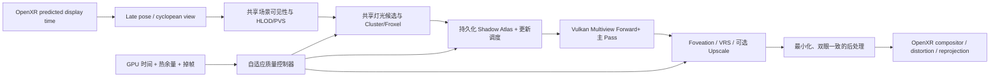

# Zevy VR 一体机渲染优化参考手册

> 文档状态：架构研究与长期参考，不代表当前功能已经实现  
> 目标平台：Android VR 一体机，OpenXR + Vulkan，PICO/Quest 级移动 SoC  
> 目标引擎：高性能、现代 PBR、动态多灯光、动态阴影、稳定双眼输出  
> 资料校正日期：2026-07-17  
> 当前项目基线：Bevy 0.16.1、wgpu 24、`bevy_mod_openxr` 0.3 的本地修改版

本文把本目录的四张网页截图作为术语和历史背景，并结合 OpenXR 1.1、Vulkan 1.1+、现代移动 tile-based GPU、2025 年多灯光研究以及 Zevy 当前代码状态进行重新推导。截图中的 Unity、OpenGL ES 和厂商 SDK 结论不能直接等同于 Zevy 的 Vulkan/Bevy 实现。

证据标记：

- **[规范]**：Khronos、OpenXR、Vulkan 等正式规范。
- **[供应商]**：Android、Arm、Qualcomm 等官方工程建议。
- **[研究]**：论文或公开技术课程，应通过目标设备复测。
- **[Zevy 现状]**：当前工作区代码能够直接确认的行为。
- **[设计假设]**：值得试验的 Zevy 方向，尚未在目标 VR 设备上证明。

---

## 1. 执行摘要：先确定引擎哲学

VR 一体机渲染不是桌面渲染的低画质版本。它同时受到双眼、高刷新率、移动 GPU 带宽、统一内存、散热、跟踪延迟和镜片畸变约束。真正可持续的现代 VR 渲染器应遵循以下原则：

1. **稳定性优先于峰值画质。** 目标是热稳定后的 P95/P99 帧时间，而不是冷机时的平均 FPS。
2. **双眼只在必须不同的地方不同。** 阴影、可见性、灯光候选、材质数据和命令编码应尽量共享；最终投影与片元结果才按眼睛区分。
3. **动态灯光不等于所有灯每像素计算，也不等于所有灯每帧更新阴影。** 灯光外观、直接光照、阴影分辨率和阴影更新频率必须解耦。
4. **优先减少像素、带宽和外部内存往返。** 一体机通常比三角形吞吐更早受到 fragment、attachment bandwidth 和热功耗限制。
5. **优化顺序是结构复用、感知复用、时间复用，最后才是牺牲正确性。** 先做 Multiview、tile-local、缓存和 foveation，再考虑删灯、删阴影或明显降低画质。

推荐的长期基线是：

> **Vulkan Multiview + 移动端 Forward+/Clustered Forward + 持久化阴影 Atlas + 阴影更新预算调度 + Foveated Rendering + 热稳定自适应质量。**

灯光数量进一步扩大时，推荐研究：

> **确定性关键灯光 + 双眼共享的随机长尾灯光采样 + 解耦低频阴影项。**

不建议把完整桌面 Deferred、Virtual Shadow Maps、逐像素 ReSTIR 或硬件光追作为第一代一体机基线。这些可以成为高端设备能力层，但不能成为最低公共路径。

---

## 2. 对提供截图的现代化校正

本目录资料：

- [doc1.png](./doc1.png)：Unity OpenXR Multi Pass 与 Single Pass Instanced。
- [doc2.png](./doc2.png)：Multi-Pass、Single-Pass、Multiview 与 Quad-View。
- [doc3.png](./doc3.png)：较早期 OpenGL ES `OVR_multiview`、multi-viewport 和 w-scaling。
- [doc4.png](./doc4.png)：Unity 各种立体渲染模式总结。

### 2.1 仍然成立的结论

- Multi-Pass 通常会重复相机级 CPU 工作、draw 编码、状态切换和一部分 GPU 工作。
- 双眼主渲染目标通常应使用二维数组纹理，每个 layer 对应一个 view。
- Shader、后处理、屏幕空间 UV、历史缓冲和 motion vector 都必须识别 view index。
- Single-Pass/Multiview 的兼容性问题是真实的，尤其是自定义后处理和第三方 Shader。
- Quad-View/Foveated Inset 可以把高像素密度集中在注视区域，但不是所有运行时都支持。

### 2.2 必须纠正的常见说法

| 历史说法 | 现代解释 |
|---|---|
| Single Pass 只“渲染一次” | 更准确地说，是记录/提交一组命令并写入多个 view layer；两个眼睛的像素仍然需要产生。 |
| Single Pass 会让 GPU 成本减半 | 它主要降低 CPU、驱动和状态开销，并可能复用部分几何工作；fragment 成本通常不会减半。 |
| Instancing 与 Multiview 完全不同 | 在 Vulkan 中应优先讨论 `VK_KHR_multiview`/Vulkan 1.1 Multiview；底层实现可由硬件自由优化。 |
| Quad-View 是某一厂商专用模式 | OpenXR 1.1 已定义 `PRIMARY_STEREO_WITH_FOVEATED_INSET` 四视图配置，但运行时支持仍是可选的。 |
| Foveation 就是降低整个纹理分辨率 | Foveation 可以通过运行时 foveation、fragment shading rate、fragment density map 或四视图实现，节省的阶段不同。 |
| MSAA 2x 就会让 fragment shader 执行两次 | 默认逐像素着色时未必如此，但覆盖、深度和颜色样本存储仍会增加；开启 sample shading 后才更接近逐样本着色。 |

Vulkan Multiview 已进入 Vulkan 1.1 核心，其目标就是用一组命令对多个 view 执行略有差异的渲染。[Vulkan `VK_KHR_multiview` 参考](https://docs.vulkan.org/refpages/latest/refpages/source/VK_KHR_multiview.html)

OpenXR 1.1 的四视图配置由两个外围 view 和两个 foveated inset view 构成，但应用必须先枚举运行时支持，不能假定 PICO、Quest 或其他设备都提供相同扩展。[OpenXR 1.1 最新完整规范](https://registry.khronos.org/OpenXR/specs/1.1/html/xrspec.html)

---

## 3. Zevy 当前渲染路径审计

这部分是制定路线的起点，不是最终架构。

| 项目 | 当前状态 | 影响 |
|---|---|---|
| 图形 API | Android Vulkan + OpenXR | 方向正确，可使用 Vulkan 1.1 Multiview，但仍需查询设备能力。 |
| 立体渲染 | OpenXR 插件创建两个独立 `XrCamera`，分别指向 swapchain array layer | **当前本质上是 Multi-Pass。** |
| Bevy Pipeline | 本地 Bevy 0.16.1 的 pipeline cache 把 wgpu `multiview` 固定为 `None` | Multiview 不是简单配置项，需要引擎渲染层修改或升级。 |
| GPU-driven | XR 相机带有 `NoIndirectDrawing` | 当前关闭 Bevy GPU transform/culling/indirect 路径，CPU 和 draw 扩展性受到限制。 |
| XR 分辨率 | `RenderQualityConfig.xr_render_scale = 0.8` | 每眼宽高 0.8，理论像素为推荐分辨率的 64%。 |
| MSAA | `msaa_samples = 2` | 是移动 VR 的合理起点，仍须实测带宽和边缘质量。 |
| 灯光分簇 | Map_S03B 特殊配置使用 `ClusterConfig::Single` | 所有灯落入一个 cluster；将来 PBR 多灯光时会使每个像素遍历过多灯，不适合作为通用方案。 |
| 当前 Map_S03B 材质 | glTF 使用 `KHR_materials_unlit` | PointLight 不会影响这些表面；当前性能测试不能代表 PBR 多灯光成本。 |
| 阴影 | Level 格式能导出 `shadows_enabled`，Bevy 支持点/聚光/方向光阴影 | 尚无持久化 atlas、静动态分离和按预算更新策略。 |
| 纹理 | 已有 mip chain、trilinear 和 anisotropic sampler | 方向正确；下一阶段是 ASTC/KTX2、分辨率分级和纹理带宽统计。 |
| 调试 | HUD 已显示 triangles、draw 估算、fragment、pass 和材质信息 | 应继续加入每 cluster 灯数、阴影 texel 更新量、热状态和双眼实际 GPU 时间。 |

当前 OpenXR 双相机循环可见于 [`render.rs`](../third_party/crates/bevy_mod_openxr-0.3.0/src/openxr/render.rs)，质量配置可见于 [`config.rs`](../src/config.rs)，Map_S03B 的单 cluster 配置可见于 [`scene.rs`](../src/scene.rs)。

### 3.1 对当前测试结果的正确解释

Map_S03B 测得：

- `Triangles / eye ≈ 208,989`，随镜头远近基本不变：当前没有有效 LOD。
- `Fragment invocations` 随画面覆盖率大幅变化，并与帧率强相关：当前更像 fill-rate/带宽瓶颈。
- VR fragment 大约是 PC 的两倍：符合双眼独立渲染预期。
- 当前材质是 Unlit：不能把这次 fragment 成本推断为动态灯光或 PBR 成本。

因此最近的 0.8 Scale 与 MSAA 2x 是正确的诊断方向，但长期引擎不能止步于统一降分辨率。

---

## 4. 一体机硬件模型：为什么桌面经验经常失效

### 4.1 Tile-Based Rendering

移动 GPU 通常把画面划分为 tile，先 binning，再让每个 tile 在片上高速存储中完成颜色、深度和混合，最后才写回统一内存。性能核心不是“有多少显存”，而是：

- attachment 是否能停留在 tile memory；
- render pass 边界是否迫使中间结果写回 RAM；
- load/store 是否明确允许丢弃无用数据；
- 是否出现全屏 ping-pong、宽 G-buffer、大量 barrier 或 compute/image 往返；
- fragment shader 是否产生高寄存器压力、分支发散和不连续纹理读取。

Khronos 的现代 TBR 指南强调保留 tile-local 数据、精确 load/store、保持 early-Z、减少宽 barrier，并指出 tile 大小是硬件细节，不应在跨平台引擎中硬编码。[Khronos Tile-Based Rendering Best Practices](https://docs.vulkan.org/guide/latest/tile_based_rendering_best_practices.html)

### 4.2 统一内存与带宽

CPU、GPU、相机、系统合成器和跟踪系统共享内存带宽。一个“只是多一次全屏 pass”的桌面优化，在一体机上可能同时增加：

- attachment 写出；
- 下一 pass 的纹理读取；
- cache eviction；
- 功耗和温度；
- compositor 等待时间。

### 4.3 热稳定性能

一体机的峰值 GPU 频率不能长期保持。高温后，CPU/GPU 降频会导致本来稳定的 90 FPS 突然进入重投影或降帧状态。Android 官方建议使用 Thermal API/ADPF 预测热余量并主动降低 framebuffer、线程或画质，而不是等待系统节流。[Android ADPF](https://developer.android.com/games/optimize/adpf)、[Thermal API](https://developer.android.com/games/optimize/adpf/thermal)

设计目标必须同时满足：

\[
T_{GPU,P99} < T_{app\_budget}, \quad
T_{CPU,P99} < T_{app\_budget}, \quad
P_{sustained} < P_{thermal}
\]

在刷新率为 \(f\) 时，每帧可持续能量近似为：

\[
E_{frame,max} = \frac{P_{sustained}}{f}
\]

从 72 Hz 提升到 90 Hz，每帧可使用的能量只有原来的 \(72/90=0.8\)。因此 90 Hz 不只是帧时间缩短 20%，也是每帧热预算减少 20%。

---

## 5. 数学预算模型

### 5.1 刷新率与帧时间

| 刷新率 | 显示周期 | 建议应用 GPU 初始目标 | 备注 |
|---:|---:|---:|---|
| 72 Hz | 13.89 ms | 10.5～11.5 ms | 画质/热稳定模式。 |
| 80 Hz | 12.50 ms | 9.5～10.5 ms | 设备支持时的折中。 |
| 90 Hz | 11.11 ms | 8.0～9.0 ms | 推荐的高性能目标，给 runtime/compositor 留余量。 |
| 120 Hz | 8.33 ms | 5.8～6.8 ms | 只适合显著简化的场景和高端设备。 |

这里的应用预算不是规范要求，而是保守起点。CPU 与 GPU 可以并行，不能简单相加；最终以 OpenXR 实际 frame timing 和设备重投影状态为准。

### 5.2 双眼像素预算

设每眼分辨率为 \(W\times H\)，view 数为 \(V\)，线性 render scale 为 \(s\)：

\[
P_{target}=VWHs^2
\]

例如每眼 1920×1920、双眼：

\[
P_{1.0}=2\times1920^2=7.37\text{ M pixels/frame}
\]

Scale 0.8 后：

\[
P_{0.8}=P_{1.0}\times0.8^2=4.72\text{ M pixels/frame}
\]

这就是为什么 0.8 不是“只省 20%”，而是理论上少 36% 的目标像素。

片元工作可以粗略写为：

\[
F \approx P_{target}\times O\times K\times q
\]

其中：

- \(O\)：不透明与透明 overdraw；
- \(K\)：执行 fragment 的 pass 数；
- \(q\)：平均 shading rate，完整分辨率为 1，2×2 VRS 理想情况下接近 1/4；
- MSAA 的覆盖/存储成本应单独计算，不能简单并入 fragment invocation。

建议 HUD 派生指标：

\[
R_{frag}=\frac{FragmentInvocations}{P_{target}}
\]

它不是严格 overdraw，因为 GPU query 可能聚合多个 pass，而且 early-Z、sample shading 和驱动实现会影响统计；但同一设备、同一构建中的相对变化非常有价值。

### 5.3 Attachment 带宽上界

近似外部内存流量：

\[
B_{frame}\approx\sum_i P_i\,m_i\,b_i\,(L_i+S_i)
\]

- \(m_i\)：MSAA 样本数；
- \(b_i\)：attachment 每样本字节数；
- \(L_i,S_i\)：是否从外部内存 load/store；
- tile memory、压缩、transient attachment 和 `DONT_CARE` 会显著降低实际值。

仍以双眼 1920×1920 为例，如果主 pass 使用 RGBA16F（8 B）和 D32（4 B），2x MSAA 的单次完整颜色+深度样本量约为：

\[
7.37\text{ M}\times12\text{ B}\times2=176.9\text{ MB/frame}
\]

如果这些数据每帧都完整流经外部内存，90 Hz 上界约 15.9 GB/s。Scale 0.8 后约 10.2 GB/s。这还没有计算纹理、shadow map、历史缓冲和后处理，因此必须尽量让主 pass 在 tile 内完成并丢弃不需要的 attachment。

### 5.4 几何吞吐

粗略三角形吞吐：

\[
R_{tri}=N_{tri/view}\times V\times f
\]

Map_S03B 的 208,989 triangles/eye 在 90 Hz 双眼下约为：

\[
208,989\times2\times90=37.6\text{ M triangles/s}
\]

该数量不一定立即成为瓶颈，但没有 LOD 意味着它不会随距离下降。Multiview 也不保证两个 eye 的 vertex shader 只运行一次；它主要保证命令复用，并允许硬件自行优化。

### 5.5 基于投影误差的 LOD

不要只用世界距离切 LOD。若模型简化误差为 \(e_w\)，到相机距离为 \(z\)，垂直分辨率为 \(H\)，垂直 FOV 为 \(\theta\)，屏幕误差近似：

\[
e_{px}=\frac{e_w H}{2z\tan(\theta/2)}
\]

当 \(e_{px}\) 低于阈值时切换到更低 LOD。VR 中左右眼应选择两眼需求的较高者，并加入 hysteresis，禁止双眼或连续帧在 LOD 边界抖动。

### 5.6 多灯光复杂度

朴素 Forward 的片元灯光成本：

\[
C_{forward}\propto\sum_{p\in pixels}|L(p)|
\]

如果一个全屏 cluster 塞入全部灯光，则近似变成：

\[
C\propto P_{target}\times N_{lights}
\]

Clustered Forward 将屏幕和深度切成 froxel：

\[
C_{clustered}\approx C_{assign}+\sum_p |L(cluster(p))|
\]

深度切片建议使用对数分布：

\[
z_i=n\left(\frac{f}{n}\right)^{i/N_z}
\]

这样近处切片不会太厚，远处也不会产生极长 cluster。16×16 或 32×32 screen tile、16～24 个 Z slice 可以作为起始实验值，不应成为硬编码结论。

Clustered Shading 的原始研究表明，加入深度和法线信息可以显著减少无效灯光计算，并改善高深度不连续场景的最坏情况。[Clustered Deferred and Forward Shading](https://diglib7.eg.org/items/6342d4d6-5220-4376-a5c6-a153058f4a3c/full)

### 5.7 阴影成本

阴影更新成本近似为：

\[
C_{shadow}\approx\sum_l u_l F_l\left(G_l+kR_l^2\right)
\]

- \(u_l\)：该灯本帧是否更新，或平均更新频率；
- \(F_l\)：spot 通常 1，point cubemap 通常 6，directional 为 cascade 数；
- \(G_l\)：shadow caster 几何成本；
- \(R_l\)：shadow map 边长；
- \(k\)：raster、store 和 filtering 的综合系数。

对一体机而言，最有效的变量往往不是继续降低 \(R_l\)，而是先把 \(u_l\) 从 1 降为按事件或按预算更新。

### 5.8 感知误差目标

VR 优化不能只最小化像素误差。建议把质量损失写为：

\[
E=w_cE_{center}+w_pE_{periphery}+w_tE_{temporal}+w_bE_{binocular}
\]

- 中央视野误差 \(E_{center}\) 权重高于外围；
- 时间闪烁/拖影 \(E_{temporal}\) 通常比静态轻微模糊更令人不适；
- 左右眼不一致 \(E_{binocular}\) 应给予最高惩罚之一。

因此，宁可让双眼外围同时轻微变糊，也不要让左右眼随机选择不同灯光、阴影或 LOD。

---

## 6. 推荐的目标渲染架构

### 6.1 五种复用

这是 Zevy 可以形成差异化的核心设计语言：

1. **双眼复用**：一次 culling、一次 draw 编码、共享 light list、共享 shadow map。
2. **空间复用**：tile/cluster 内共享灯光候选、材质数据和阴影结果。
3. **时间复用**：静态 shadow cache、低频更新、历史稳定性。
4. **感知复用**：foveation、外围低 shading rate、独立高清 UI layer。
5. **语义复用**：关键灯保持确定性；装饰灯、远灯和次要阴影采用低成本近似。

任何新特性都应回答：它复用了什么？如果它只是增加一个全屏 pass 或一套历史缓冲，就必须证明收益大于带宽和延迟成本。

---

## 7. 立体渲染：从当前 Multi-Pass 走向 Vulkan Multiview

### 7.1 模式比较

| 模式 | CPU 提交 | GPU 几何 | Fragment | 兼容性 | 建议 |
|---|---:|---:|---:|---|---|
| Multi-Pass | 近似按 view 重复 | 按 view 重复 | 按 view 重复 | 最好 | 调试与兼容 fallback。 |
| Double-Wide Single-Pass | 命令可部分共享 | 仍有双眼工作 | 双眼像素 | 后处理易出错 | 历史方案，不作为新架构目标。 |
| Instanced Stereo | 一次 draw、实例区分 eye | 实现相关 | 双眼像素 | Shader 要识别 eye | 可用，但 Vulkan 更应直接看 Multiview。 |
| Vulkan Multiview | 一组命令写多个 layer | 由硬件优化 | 双眼像素 | 需 pipeline、Shader、pass 全链支持 | Zevy 长期基线。 |
| Quad/Foveated Inset | 2 或 4 view | 额外 view 工作 | 可显著减少外围像素 | 运行时可选 | 高端能力层。 |

### 7.2 Multiview 实际能省什么

优先收益：

- draw command encoding；
- pipeline/state 设置；
- CPU 到驱动的调用；
- per-view resource binding；
- 某些 GPU 上的顶点获取和几何调度；
- 更容易共享一个 layered depth/color pass。

不能指望它自动节省：

- 双眼目标像素；
- PBR fragment shader；
- 每眼屏幕空间后处理；
- 需要不同 view-space 数据的计算。

### 7.3 Zevy 的实现障碍

[Zevy 现状] wgpu 24 已有 render pipeline 的 `multiview` 字段，但 Bevy 0.16.1 的 pipeline cache 当前固定为 `None`。因此不能只把两个相机改成一个相机；至少需要：

- layered color/depth view；
- render pass view mask；
- pipeline multiview count；
- Shader 中的 view index；
- 两套 view/projection uniform；
- PBR、shadow receiver、fog、UI、post-process 全链验证；
- 对不支持或存在驱动问题的设备保留 Multi-Pass fallback。

### 7.4 双眼共享可见性

CPU 可用一个包含左右眼 frustum 的 conservative union frustum 做第一次粗裁剪，再为每眼做很轻的精裁剪。室内场景还应在此之前使用 room/portal/PVS，避免整个关卡进入双眼可见集。

### 7.5 Late Latching 与预测姿态

相机姿态应尽可能接近提交时根据 OpenXR predicted display time 更新。不要为了多线程提前很多毫秒冻结 eye matrix。Multiview 共享 draw list，但左右眼 view matrix 必须保持与同一 predicted time 一致。

---

## 8. 移动 VR 的主渲染路径：Forward+ 优先

### 8.1 为什么不是完整 Deferred

完整 Deferred 的优势是材质与灯光解耦，但移动 VR 的代价是：

- 多个宽 G-buffer attachment；
- 双眼和 MSAA 放大存储；
- G-buffer 写回/读取的外部带宽风险；
- 透明和特殊材质仍需额外 forward；
- 多个 pass 增加 latency 和 barrier。

因此推荐 Forward+/Clustered Forward 作为通用基线：

- 原生支持 MSAA；
- PBR、透明和自定义材质统一；
- G-buffer 更少；
- 对 tile GPU 更容易保持主颜色和深度在片上；
- 灯光数量由 cluster list 控制，而不是固定每物体灯数。

### 8.2 何时考虑 Tile-Local Deferred

只有满足以下条件时才值得实验：

- 设备能把 G-buffer subpass 合并并保留在 tile memory；
- attachment 数量和格式很窄；
- 大量材质共享统一 lighting pass；
- MSAA 成本可接受；
- AGI/厂商 counter 证明没有发生外部 G-buffer round-trip。

Arm/Khronos 的移动 Vulkan 案例表明，成功的 subpass merging 可以大幅减少 G-buffer 读写，但这依赖设备和 render pass 结构，不能仅凭 API 形式推断。[Arm/Khronos Vulkan Samples](https://developer.arm.com/community/arm-community-blogs/b/mobile-graphics-and-gaming-blog/posts/vulkan-samples)

### 8.3 Cluster 配置原则

- 不使用整个视图一个 `ClusterConfig::Single` 作为多灯光通用路径。
- 以屏幕 tile + 对数 Z slice 建立 froxel。
- 对 PointLight 使用 sphere-vs-froxel，对 SpotLight 使用 cone-vs-froxel。
- cluster list 需要 overflow 统计；不能静默丢弃灯光。
- cluster far plane 应覆盖“能影响可见表面”的范围，而不是只按灯中心到相机距离。
- 灯的物理 `range` 是照明截止半径，不是“相机能看见灯”的距离。

### 8.4 Cyclopean Cluster：双眼共享灯光列表

**[设计假设]** 左右眼 frustum 高度重叠，可以用头部中心的 cyclopean view 建立共享 froxel，或用双眼投影包围体扩大 tile 边界：

- 优点：light assignment 只做一次；左右眼使用一致的候选灯光；缓存更友好。
- 代价：近距离和画面边缘会出现 conservative false positive，每 cluster 灯数略高。
- 保护措施：近场物体或极宽 FOV 可回退到 per-eye 精细列表；必须统计平均/最大 lights per cluster。

共享 cluster 也可统一承载 decals、reflection probes、fog volumes 和局部环境探针，使空间查询成本集中到一次。

---

## 9. 高数量动态灯光：确定性主干 + 随机长尾

### 9.1 第一阶段：完全确定性的 Clustered Forward

在几十个可见局部灯以内，首先使用完全确定性列表：

- 每个 cluster 保存所有真正相交的灯；
- 按灯类型分组，减少 shader divergence；
- 关键灯优先放在连续内存；
- 对非常弱的灯使用基于最大可能照度的 conservative 剔除；
- 设置“每 cluster 软预算”而不是硬截断。

物理量可帮助排序。各向同性 PointLight 的光通量为 \(\Phi\) 流明时，近似光强：

\[
I_v=\frac{\Phi}{4\pi}\quad(\text{candela})
\]

距离 \(d\) 处照度：

\[
E(d)=\frac{I_v}{d^2}
\]

实际实时渲染应使用平滑 cutoff，避免 `range` 边缘突然消失。例如：

\[
a(d)=\frac{\max(1-(d/R)^4,0)^2}{\max(d^2,\epsilon)}
\]

`range=R` 只定义物理影响截止，发光模型的 emissive 可视距离应由普通 mesh culling 独立控制。

### 9.2 第二阶段：关键灯与长尾灯分离

当一个 cluster 中有太多灯时，不应简单取最近 N 个，因为会造成灯光 popping 和能量丢失。建议：

- **Hero/Deterministic set \(H\)**：太阳、手电、剧情灯、最近的强灯、会产生明显阴影的灯，每像素稳定计算。
- **Tail set \(T\)**：装饰灯、远灯、弱灯、重复烛火，通过 tile 级 importance sampling 选择少量样本。

简化的无偏估计：

\[
\hat L(x)=\sum_{l\in H}f_l(x)+\frac{1}{K}\sum_{i=1}^{K}\frac{f_{s_i}(x)}{p(s_i)}
\]

其中 \(p(l)\) 可按投影影响、亮度、BRDF 上界和粗略可见性构建：

\[
p(l)\propto Y_l\,A_{screen,l}\,B_{max,l}\,V_{approx,l}
\]

### 9.3 双眼一致随机采样

**这是 VR 特有的硬要求。** 不要让左右眼独立随机选灯，否则可能出现左右眼亮度、阴影和高光不一致。

建议：

- 从 cyclopean tile/froxel 产生同一组 light sample/reservoir；
- 左右眼共享 light ID 与随机序列；
- 每眼仍使用自己的 position、normal、BRDF 和 shadow coordinate 评估；
- Hero lights 永远确定性；
- 随机噪声使用世界空间或头中心稳定 seed，避免转头时噪声粘在屏幕上；
- 时间累计要短、保守，优先稳定而不是追求桌面式长历史收敛。

### 9.4 为什么这个方向值得研究

SIGGRAPH 2025 的 Stochastic Tile-Based Lighting 将采样从逐像素移动到 tile，使用两阶段 reservoir，在小 tile 中只保留固定 1～4 个灯，并把阴影评估从最终 lighting shader 解耦。公开结果显示该算法在 Adreno 610/830 上能以接近固定的成本处理很多局部灯，但它仍是带噪声、依赖重建的研究型方案，数据不能直接当作 Zevy 性能承诺。[Stochastic Tile-Based Lighting 2025](https://advances.realtimerendering.com/s2025/content/s2025_stb_lighting_v1.1_notes.pdf)

Zevy 可以采用更保守的混合版本：

1. 先实现完全确定性的 Clustered Forward。
2. 仅在 cluster overflow 时采样长尾。
3. 关键灯和近场灯永不随机。
4. 两眼共享样本。
5. 先不依赖长历史 TAA，必要时增加 K 而不是强行去噪。

这能把创新风险隔离在 overflow 路径，不破坏普通场景的确定性。

---

## 10. 动态阴影系统：数量不是核心，更新预算才是核心

### 10.1 持久化 Shadow Atlas

为 Spot、Point 和 Directional shadow 建立持久化 atlas：

- atlas slot 跨帧保留；
- 灯或 caster 没变化时不重绘；
- resolution 量化为 128/256/512/1024 等档位；
- slot 有 border，防止 PCF 泄漏；
- D16 优先作为移动端起点，精度不足时局部升级；
- 4096² D16 atlas 为 32 MiB，2048² D16 为 8 MiB，不含额外临时缓冲。

2025 STB Lighting 公开方案同样使用持久化 16bpp atlas、按相机距离调整 shadow map、静态/动态 shadow 分类和跨帧优先队列更新。[STB Shadow Map Atlas](https://advances.realtimerendering.com/s2025/content/s2025_stb_lighting_v1.1_notes.pdf)

### 10.2 静态与动态 caster 分离

对“灯静止、建筑静止、只有玩家或少量门移动”的场景：

- `StaticShadow`：只包含静态 geometry，仅在灯、静态 caster 或分辨率变化时更新。
- `DynamicShadow`：只包含动态 caster，按帧或按预算更新。
- 最终可见性：

\[
V=V_{static}\times V_{dynamic}
\]

代价是多一次 shadow compare，但可以避免每帧把整座建筑为每盏灯重画。若动态物体很少，这通常非常划算。

### 10.3 阴影重要度与调度

每盏灯的更新优先级可以定义为：

\[
Priority_l=\frac{A_{screen,l}\,Y_l\,C_l\,M_l\,Age_l\,Critical_l}{Cost_l+\epsilon}
\]

- \(A_{screen}\)：灯影响体在画面的投影面积；
- \(Y\)：亮度或最大可能照度；
- \(C\)：预计阴影对比度；
- \(M\)：灯/caster 运动程度；
- \(Age\)：距离上次更新的时间，防止长期饥饿；
- \(Critical\)：剧情和交互权重；
- \(Cost\)：上次真实 GPU 更新成本或 caster 数预测。

系统每帧消耗的是固定 **shadow GPU 毫秒预算**，不是固定灯数。初始可为 90 Hz 总预算中的 1.0～1.8 ms，再根据目标设备调整。

### 10.4 建议更新层级

| 阴影类型 | 更新策略 | 视觉代价 |
|---|---|---|
| 玩家手电/交互 Hero Light | 每帧或运动时每帧 | 最低延迟，成本最高。 |
| 静止灯 + 静止建筑 | 仅 invalidation | 几乎无可见损失。 |
| 静止灯 + 少量动态物体 | static cache + dynamic overlay | 多一次 compare，省大量 caster 重绘。 |
| 中距离装饰灯 | 15～30 Hz 更新并插值/稳定化 | 快速运动时会有轻微滞后。 |
| 远距离弱灯 | 5～15 Hz 或无阴影 | 近看前必须平滑升级。 |
| 非关键长尾灯 | 无 shadow map，使用 AO/contact proxy | 物理正确性下降。 |

升级和降级必须使用不同阈值与最短驻留时间，避免灯光在 shadow tier 之间闪烁。

### 10.5 PointLight 是阴影预算杀手

| Point shadow 表示 | 几何 pass | 优点 | 缺点 |
|---|---:|---|---|
| Cubemap | 6 | 简单、方向均匀 | 六面 geometry/raster，最昂贵。 |
| Dual paraboloid | 2 | pass 少 | 接缝、畸变、过滤复杂。 |
| Octahedral atlas | 存储高效 | 单张正方形、采样一致 | 直接生成复杂；常见做法仍先渲染 cubemap 再转换。 |
| 用 SpotLight 近似 | 1 | 性能最佳 | 只适合有方向性的灯具。 |

工程上应让美术标注真实灯型。壁灯、灯笼开口、射灯和蜡烛附近的主投影很多时候可用一个或两个 spot 近似，而不是默认全向 point cubemap。

### 10.6 阴影分辨率

shadow map 边长应跟随投影尺寸，而不是只按世界距离：

\[
R_l=2^{round\left(\log_2\left(clamp(k\sqrt{A_{screen,l}},R_{min},R_{max})\right)\right)}
\]

使用平方根是因为 texel 数与面积成正比。分辨率变化需要 hysteresis，否则 atlas 会频繁搬迁和重绘。

### 10.7 过滤策略

- 基线：2×2/4-tap hardware PCF。
- 低成本软化：旋转 Poisson/随机 PCF，但双眼噪声必须相关。
- PCSS/contact hardening：只给 Hero light。
- 屏幕空间 contact shadow：补细节，不替代主 shadow map；必须处理双眼和 disocclusion。
- Ray-traced shadow：仅设备能力层，不作为一体机公共基线。

### 10.8 蜡烛闪烁的特殊优化

改变灯光 intensity/color 不需要重画 shadow map；改变 position/direction 才会让阴影失效。因此：

- 高频火光变化主要驱动 intensity、color、emissive；
- 阴影投影的轻微摇动用平滑低频噪声，15～30 Hz 或按预算更新；
- 不要每帧随机移动 PointLight 后重画六面 cubemap；
- 可以用 light cookie、normal perturbation 或低分辨率 shadow mask 模拟投影跳动。

这能保留“活的火光”，同时把最昂贵的 shadow update 与视觉闪烁解耦。

---

## 11. Foveation、分辨率、抗锯齿与重建

### 11.1 不同技术节省的不是同一种工作

| 技术 | 减少 raster pixel | 减少 fragment shading | 减少 attachment 带宽 | 主要风险 |
|---|---:|---:|---:|---|
| Render Scale | 是 | 是 | 是 | 全画面变糊。 |
| Fixed Foveation | 取决于实现 | 是 | 可能 | 眼睛看外围时可见模糊。 |
| Eye-tracked Foveation | 取决于实现 | 是 | 可能 | gaze 延迟/丢失、设备支持。 |
| Vulkan Fragment Shading Rate | 通常不减少 coverage | 是 | 部分 | 粗 shading block 边界、硬件差异。 |
| Fragment Density Map | 是 | 是 | 是 | API/运行时依赖。 |
| Quad/Foveated Inset | 是 | 是 | 是 | 四视图几何与合成复杂度。 |
| Spatial Upscale | 是 | 是 | 是 | 闪烁和细节丢失。 |
| Temporal Upscale | 是 | 是 | 是 | ghosting、双眼历史、motion vector 成本。 |
| Space Warp/Frame Synthesis | 应用每秒帧数下降 | 大幅 | 大幅 | disocclusion、动态光影和延迟伪影。 |

Vulkan `VK_KHR_fragment_shading_rate` 允许一个 fragment invocation 覆盖多个像素，特别适合 VR 外围低感知区域；实际支持的 rate 和 layered attachment 能力必须查询。[Vulkan Fragment Shading Rate](https://docs.vulkan.org/features/latest/features/proposals/VK_KHR_fragment_shading_rate.html)

### 11.2 OpenXR Foveation 能力层

运行时启动时应枚举并形成 capability matrix，而不是按品牌硬编码：

- `XR_FB_foveation` / `XR_FB_foveation_vulkan`；
- `XR_META_foveation_eye_tracked` 或其他厂商 gaze-foveation；
- OpenXR 1.1 foveated inset view configuration；
- `VK_KHR_fragment_shading_rate`；
- fragment density map 类扩展；
- 无任何支持时回退到 render scale。

OpenXR 扩展是可选的，即使规范存在也不代表当前 PICO runtime 一定实现。[OpenXR 扩展规则](https://registry.khronos.org/OpenXR/specs/1.1-khr/html/xrspec.html)

### 11.3 MSAA

移动 VR 的推荐起点是 2x：

- Off：只用于诊断或有可靠替代 AA 时使用；
- 2x：常见性能/质量平衡；
- 4x：画质模式，必须测 attachment 带宽；
- 8x：通常不适合作为一体机默认。

MSAA resolve 应尽量在 render pass 内 on-tile 完成，避免单独 `ResolveImage` 造成外部内存往返。Arm 的 Vulkan best-practice validation 也明确把独立 MSAA resolve 视为移动端高带宽风险。[Arm Vulkan MSAA Best Practice](https://developer.arm.com/community/arm-community-blogs/b/mobile-graphics-and-gaming-blog/posts/arm-best-practice-warnings-in-vulkan-sdk)

### 11.4 Temporal Upscaling

FSR2 等时域重建可从低分辨率恢复细节，并支持 Vulkan；但 VR 接入必须额外验证：

- 每眼独立且正确的 motion vector；
- jitter 与非对称投影；
- late pose 和历史矩阵的一致性；
- 头部快速旋转时的 ghosting；
- 双眼历史不一致；
- UI、透明、粒子和 emissive 的 reactive mask。

[AMD FSR2 Vulkan 文档](https://gpuopen.com/fidelityfx-superresolution-2/)证明技术可用于 Vulkan，但不等于它天然适合当前 OpenXR/Bevy 管线。Qualcomm 也在新一代 Snapdragon 中推广 SGSR2；对 Zevy 应当作为按 GPU 能力选择的可选重建后端，而不是唯一依赖。[Qualcomm Adreno 低功耗渲染建议](https://www.qualcomm.com/developer/blog/2025/08/optimize-performance-and-graphics-for-adreno-gpu-low-power-gaming)

### 11.5 UI 与文字

主场景降低分辨率时，把关键 HUD、菜单和调试文字放在 OpenXR compositor quad/cylinder layer 中，可保持文字清晰，并避免主场景 MSAA/tonemap。代价是 layer 数量、遮挡关系和平台兼容性，需要 capability fallback。

---

## 12. 几何、可见性与场景组织

### 12.1 室内场景优先 Portal/PVS

Map_S03B 类室内长廊和房间非常适合：

1. Level 导出时生成 room/cell。
2. 门、洞口生成 portal。
3. 运行时先按当前 room 得到候选 room 集。
4. 再做 union-frustum、per-eye 和 occlusion culling。

这比单纯 HZB 更稳定，也能同时裁掉：

- mesh；
- light；
- reflection probe；
- shadow caster；
- audio/particle；
- texture streaming 请求。

### 12.2 LOD 与 HLOD

- 静态模型使用 projected-error LOD。
- 很多小物件合成 room-level HLOD，降低 draw call。
- 大型墙、地面不能跨越整个关卡，否则只露出一角也会保持可见。
- 合并物件时保留合理 spatial chunk，避免“为了 batching 破坏 culling”。
- 阴影可使用独立更粗的 shadow LOD。
- 左右眼、主画面和 shadow pass 使用统一稳定的 LOD 决策，避免轮廓不一致。

### 12.3 Occlusion Culling

- CPU portal/PVS：室内第一选择。
- HZB occlusion：适合复杂开放区域；结果至少延后一帧，需要 conservative expansion。
- GPU indirect culling：可降低 CPU，但依赖 Bevy/wgpu XR 路径支持。
- 选择性 depth prepass：只在高不透明 overdraw、昂贵 fragment 或 HZB 需要时开启；移动 tiler 上完整 depth prepass 可能重复 geometry 和带宽，必须 A/B。

### 12.4 Instancing 与 draw call

- 相同 mesh + material 的静态重复物件应实例化。
- 材质参数尽量放进 instance data，避免生成大量 shader/material variant。
- 小 draw call 比单纯三角形数量更容易造成 CPU/驱动瓶颈。
- Multiview 解决的是 view 维度重复，不能替代普通 instancing。

---

## 13. 材质、PBR 与纹理

### 13.1 两条明确材质路径

1. **Unlit Fast Path**：UI、火焰核心、特殊装饰、调试物件。
2. **Mobile PBR Path**：受动态灯光影响的建筑和物体。

“自发光”与“照亮环境”必须分离：emissive 材质本身变亮，但不会自动给周围表面贡献直接光；仍需 analytical light、baked GI 或其他光照表示。

### 13.2 Mobile PBR 建议

- GGX 主路径，但减少可选 lobes。
- base color + normal + packed ORM 作为常用上限。
- 无 normal map 的材质使用独立便宜 variant。
- clear coat、transmission、subsurface、anisotropy 仅 Hero 材质启用。
- BRDF LUT 和环境光探针共享。
- 颜色/粗糙度/多数中间值使用 16-bit 精度；世界坐标、深度重建等保持足够精度。
- 材质分支应按 pipeline variant 拆分，避免每片元动态执行大量永远为 false 的高级特性。

### 13.3 纹理

- Android 颜色纹理优先 ASTC，按内容选择 block size。
- 始终生成完整 mip chain；远处闪烁与纹理 cache 同时改善。
- 法线、mask、颜色需要不同压缩和色彩空间。
- 纹理尺寸按屏幕 texel density，而不是全部 4K。
- anisotropy 先以 4x 为移动基线，8x/16x 只给地面和斜视关键材质。
- 统计实际 residency、每帧 texture bytes 和 sampler cache miss，而不是只看磁盘大小。

Android 最新 GPU 优化建议同样强调 ASTC、半精度 attachment、删除无用 pass/attachment、LOD 和 Shader precision。[Android CPU/GPU Optimization Tips](https://developer.android.com/games/optimize/optimization-tips)

---

## 14. Render Pass 与移动带宽规则

### 14.1 主规则

- 尽量一个主 geometry/lighting render pass 完成不透明画面。
- depth、MSAA color 等中间 attachment 使用 transient/lazy memory（后端支持时）。
- 不需要保留的 attachment 使用 `storeOp = DONT_CARE`。
- 清屏优先 attachment clear，不使用全屏 quad。
- MSAA inline resolve。
- 后处理尽量合并，避免每个效果一读一写全屏纹理。
- render pass 之间的 barrier 只覆盖真实 stage/access，避免 `ALL_COMMANDS`。

### 14.2 HDR 格式 trade-off

| 格式 | 字节/像素 | 优点 | 限制 |
|---|---:|---|---|
| RGBA16F | 8 | 精度高、通用 | 双眼+MSAA 带宽高。 |
| R11G11B10F | 4 | HDR 颜色带宽减半 | 无 alpha，部分混合/后处理受限。 |
| RGB10A2 | 4 | 有 alpha、带宽低 | HDR 范围和精度有限。 |
| LDR RGBA8 | 4 | 最便宜 | 不适合高动态 PBR/bloom 链。 |

可考虑主不透明路径使用紧凑 HDR，只有确实需要 alpha 的 pass 使用 RGBA16F。必须验证 wgpu/设备 renderability、blend 和滤波支持。

### 14.3 Compute 不是自动更快

Compute pass 可能：

- 破坏 tile compression/transaction elimination；
- 迫使图像转为 storage layout；
- 增加 barrier；
- 与 fragment 争用 shader core；
- 在某些 GPU 上改善 wave coherence，在另一些 GPU 上更慢。

优先从数据局部性和 pass 合并判断，而不是从“现代算法使用 compute”推断性能。Khronos TBR 指南明确提醒 broad barrier 会破坏 binning 与 fragment 阶段重叠。[TBR Pipelining and Barriers](https://docs.vulkan.org/guide/latest/tile_based_rendering_best_practices.html)

---

## 15. CPU、提交与 OpenXR 时序

### 15.1 CPU 预算模型

\[
T_{CPU}\approx N_{draw}c_{draw}+N_{visible}c_{cull}+N_{lights}c_{light}+T_{sim}+T_{XR}
\]

Multi-Pass 会把相机相关部分近似乘以 view 数；Multiview 主要减少这一部分。

### 15.2 建议

- 场景更新、可见性、灯光分配和 draw preparation 分任务并行。
- 使用稳定 ring buffer，避免每帧小 allocation。
- pipeline 与 shader 提前编译，避免 VR 中途卡顿。
- descriptor/bind group 按材质布局复用。
- 使用 OpenXR `xrWaitFrame` 给出的节奏，不让 CPU 无限制提前排队。
- 预测 pose、controller 和 hand 在靠近提交处更新。
- 将 shader compilation、纹理上传和 atlas 重排分帧执行。

### 15.3 GPU-driven 的位置

[Zevy 现状] XR 相机当前有 `NoIndirectDrawing`。长期应验证恢复 GPU transform/culling/indirect 是否能在 OpenXR 目标上工作，并比较：

- CPU draw preparation 是否下降；
- GPU culling pass 是否抵消收益；
- 小场景是否反而增加固定成本；
- Multiview 是否能共享 indirect buffer；
- Android 驱动和 wgpu 的稳定性。

---

## 16. 自适应质量与热管理

### 16.1 控制目标

不要直接用 FPS 控制质量。FPS 在重投影或 runtime 节流下是离散结果，应优先使用：

- app GPU time；
- CPU main/render time；
- P95/P99；
- missed/reprojected frame；
- thermal headroom；
- GPU/CPU frequency；
- fragment/target pixel；
- shadow update GPU ms。

简单误差：

\[
e_t=T_{target}-T_{GPU,t}
\]

质量控制可以使用有上下限、低增益和 hysteresis 的 PI/阶梯控制，而不是每帧剧烈变化。

### 16.2 三个时间尺度

| 时间尺度 | 可调参数 | 原因 |
|---|---|---|
| 快速：数帧～0.5 秒 | shadow update budget、长尾灯 K、FFR level、非关键后处理 | 不需重建大资源，可快速救帧。 |
| 中速：0.5～5 秒 | shadow resolution、LOD bias、材质高级特性、粒子密度 | 需要稳定驻留，防止闪烁。 |
| 慢速：数秒～分钟 | swapchain render scale、刷新率、热质量档 | 资源重建或用户可察觉，避免频繁切换。 |

### 16.3 建议降级顺序

以视觉损失最小为目标：

1. 推迟不可见/低重要度 shadow update。
2. 降低远灯 shadow resolution 或取消其阴影。
3. 提高外围 foveation。
4. 减少随机长尾灯 sample 数，保留 Hero lights。
5. 关闭低价值全屏后处理。
6. 降低 render scale。
7. 提高 LOD/HLOD bias、粒子和反射更新间隔。
8. 最后才切换更低刷新率或启用 frame synthesis/space warp。

升级顺序应反向但更慢。例如连续数秒 GPU P95 < 目标的 70% 且 thermal 安全才升级；连续 30～60 帧超过 90% 可降级。具体阈值必须实机确定。

### 16.4 热测试

- 冷机 microbenchmark 用来比较算法。
- 正式质量档必须运行 20～30 分钟 thermal soak。
- 记录室温、电量、充电状态、刷新率和亮度。
- 固定性能模式只用于可重复微基准，不能代替真实热稳定测试。
- Android 官方建议将 thermal state 纳入性能遥测，而不是只记录 FPS。[Android 性能分析流程](https://developer.android.com/games/optimize/gameperformance)

---

## 17. 可选 Trade-off 总表

| 决策 | 性能收益 | 画质/工程代价 | 何时选择 |
|---|---|---|---|
| 90 Hz → 72 Hz | 每帧时间和能量预算增加 25% | 运动流畅度和延迟下降 | 热稳定无法维持 90 Hz 时。 |
| Scale 1.0 → 0.8 | 目标像素约 -36% | 全画面清晰度下降 | Fill-rate/带宽受限的第一诊断项。 |
| MSAA 4x → 2x | attachment/sample 成本显著下降 | 边缘质量下降 | 移动 VR 常用基线。 |
| Multi-Pass → Multiview | 降 CPU/draw/state，可能省几何 | 引擎和 Shader 改造较大 | 中长期最高优先结构优化。 |
| Per-eye cluster → Cyclopean cluster | 灯光分配近似减半、双眼一致 | false positive 增加 | 双眼 frustum 高重叠时。 |
| Deferred → Forward+ | 降 G-buffer 带宽，MSAA 友好 | 每材质执行 lighting | 移动 VR 默认。 |
| Forward+ → Tile-local Deferred | 多材质/多灯可能更稳定 | attachment/subpass 复杂 | 只有实机证明 subpass merge 时。 |
| 所有灯确定性 → Hero+随机长尾 | 灯数扩展到固定近似成本 | 噪声、去噪和研发风险 | cluster overflow、高灯数模式。 |
| Point shadow → Spot 近似 | 6 pass 可降到 1～2 | 光型改变 | 灯具有方向或可接受艺术近似。 |
| 每帧 shadow → Cached/Budgeted | 最大阴影收益之一 | 更新滞后和调度复杂度 | 大多数静态建筑场景。 |
| Full-res shadow term → 2×2 shared | 阴影采样约降到 1/4 | 轮廓变软/偏差 | 中远距离、配合稳定重建。 |
| RGBA16F → R11G11B10F | HDR color bandwidth 约减半 | 无 alpha、精度变化 | 主不透明 HDR。 |
| 完整 depth prepass → selective | 减少重复 geometry | overdraw 可能增加 | Tile GPU、低 overdraw 场景。 |
| 各向异性 16x → 4x | 纹理采样带宽下降 | 斜视纹理变糊 | 普通材质；关键地面单独升级。 |
| 全 PBR features → material tiers | Shader 更短、variant 更少 | 美术约束 | 一体机公共路径。 |
| Temporal upscale | 可显著降低内部像素 | ghosting/motion vector/历史成本 | 高质量能力层，逐设备验证。 |
| Space Warp/Frame Synthesis | 应用帧率可近似减半 | 动态物体、阴影、disocclusion 伪影 | 最后防线或独立质量模式。 |
| Virtual Shadow Maps | 精细大场景阴影 | page table、带宽、更新复杂 | 不作为第一代移动 VR 基线。 |
| Ray-traced shadows | 几何正确、统一光型 | 硬件/功耗/去噪 | 高端设备单 Hero light 实验。 |

---

## 18. 推荐的 90 Hz 初始 GPU 预算模板

以下只是开始测量的 envelope，总应用 GPU 目标约 8.5 ms，不是硬性分配：

| 模块 | 初始预算 | 说明 |
|---|---:|---|
| 可见性、depth/HZB、cluster build | 0.8 ms | 室内 PVS 可进一步下降。 |
| Shadow updates | 1.3 ms | 只统计本帧真正更新的 atlas 区域。 |
| Opaque Forward+ PBR | 3.5 ms | 双眼合计，含确定性灯光。 |
| 长尾灯/解耦阴影项 | 0.6 ms | 未启用时归还预算。 |
| Transparent/particles | 0.4 ms | 严格控制 overdraw。 |
| Tonemap/upscale/post | 0.9 ms | 尽量合并。 |
| UI/composition preparation | 0.2 ms | compositor layer 另由 runtime 处理。 |
| Buffer upload/杂项余量 | 0.8 ms | 避免预算刚好等于 11.11 ms。 |

如果某个功能超预算，应先问它能否跨眼、跨 tile 或跨帧复用，再考虑降低质量。

---

## 19. Profiling：必须回答的问题

### 19.1 每帧 HUD/Telemetry

至少记录：

- 实际每眼分辨率、view 数、render scale、MSAA；
- CPU main/render、GPU frame、P50/P95/P99；
- missed/reprojected frames；
- triangles/view、draw/view、GPU primitives；
- fragment invocations 和 `fragment/target pixel`；
- visible mesh/material/light 数；
- 平均/最大 lights per cluster、overflow cluster 数；
- shadowed light 数、更新 light 数、更新 texel 数、shadow GPU ms；
- texture residency、上传量、估算 attachment bandwidth；
- thermal headroom、CPU/GPU level/frequency；
- 当前质量控制器状态和降级原因。

OpenXR 新规范中已有厂商 performance metrics 与 frame synthesis 扩展，但都必须运行时查询；同时仍应使用 Android/厂商 GPU profiler 获取硬件 counter。[OpenXR API Reference](https://registry.khronos.org/OpenXR/specs/1.1/man/html/openxr.html)

### 19.2 工具

- Zevy VR 内置 HUD：现场定位和长时间观察。
- Android GPU Inspector：Vulkan calls、framebuffer、draw、pipeline、texture 和 GPU counter。[AGI Frame Profiler](https://developer.android.com/agi/frame-trace/frame-profiler)
- RenderDoc Android：pass/attachment/资源正确性。
- Snapdragon Profiler：Adreno counter、功耗和瓶颈分析。
- Perfetto/System Trace：CPU 调度、frame pacing、频率和热状态。
- Vulkan Best Practices Validation：开发构建检查移动 GPU 常见反模式。

### 19.3 标准测试镜头

每个构建都跑相同 camera path：

1. 近距离贴墙：最大 screen coverage、纹理和 fragment 压力。
2. 长廊远眺：mipmap、LOD、远灯和 cluster far range。
3. 七灯同时可见：多灯分配和阴影预算。
4. 快速转头：late pose、temporal ghosting 和 foveation。
5. 门口跨 room：portal/PVS 和 streaming。
6. 动态物体穿过多灯：dynamic shadow overlay。
7. 20～30 分钟循环：thermal stability。

### 19.4 A/B 原则

- 一次只改一个变量。
- 同一设备、同一 runtime、同一刷新率、同一路径。
- 记录冷机和热稳定两套结果。
- 比较 GPU ms 和 P99，不只看 FPS。
- 如果 fragment 数下降但 GPU 不变，检查是否转为 vertex、texture、bandwidth 或 CPU bound。
- 如果 PC 有效、Android 无效，优先检查 tile bandwidth、驱动扩展、precision 和 thermal，而不是直接扩大灯光 range。

---

## 20. Zevy 研究路线图（不是本次开发任务）

### 阶段 0：可信测量

- 完成 GPU pass、双眼分辨率、MSAA、fragment/px、cluster 和 shadow telemetry。
- 建立固定 camera path 与 thermal soak。
- 输出设备 capability matrix。

成功标准：任何掉帧都能回答是 CPU、geometry、fragment、bandwidth、shadow 还是 thermal。

### 阶段 1：消除双眼结构重复

- Vulkan Multiview 最小原型。
- 保留 Multi-Pass fallback。
- 共享 union-frustum culling、draw list 和 shadow pass。
- 评估恢复 indirect drawing。

成功标准：画面完全一致，CPU render time/draw submission 明显下降，fragment 数不会被误解为减半。

### 阶段 2：Mobile PBR + 正常 Clustered Forward

- 从 `ClusterConfig::Single` 迁移到可调 froxel。
- 建立 material tier 和简单 GGX。
- 正确分离 light physical range 与 emitter visibility。
- cluster overflow 可视化。

成功标准：七灯或更多灯同时影响远处可见墙面，不依赖扩大 range，也不让每像素遍历全部灯。

### 阶段 3：持久化阴影系统

- Shadow atlas、静态 cache、dynamic overlay。
- 按 GPU 毫秒预算调度。
- Point/Spot authoring 策略。
- 独立 shadow LOD 和 resolution tier。

成功标准：静态七灯可长期保留阴影，只有发生变化的 atlas 区域更新，移动物体没有明显 shadow lag。

### 阶段 4：Foveation 与自适应质量

- OpenXR extension/capability matrix。
- FFR/VRS、render scale、MSAA quality profiles。
- thermal-aware controller。
- 高清 compositor UI layer。

成功标准：高负载时优先牺牲外围和非关键阴影，P99 恢复且无左右眼不一致。

### 阶段 5：突破性多灯光路径

- Cyclopean/shared cluster。
- Hero deterministic + sampled tail。
- 双眼共享 reservoir/noise。
- 解耦 2×2 shadow term。
- 不依赖长历史的 VR 稳定策略。

成功标准：灯数增长时成本接近固定；关键灯完全稳定；随机长尾没有可感知 binocular mismatch、闪烁或明显能量偏差。

### 阶段 6：高端能力层

- Eye-tracked foveation / foveated inset views。
- Temporal upscaling。
- Space warp/frame synthesis。
- 单个 Hero light ray-query shadow。
- Tile-local deferred 实验。

这些都必须是 capability-driven，可完全回退到阶段 4 的公共路径。

---

## 21. 设计评审清单

增加任何渲染功能前，必须回答：

### 双眼

- 是否重复了本可共享的 CPU/draw/culling 工作？
- 左右眼随机数、LOD、灯光和阴影是否一致？
- 后处理是否正确识别 array layer/view index？

### 像素与带宽

- 新增多少目标像素、attachment 字节和全屏 pass？
- 中间结果能否保持在 tile memory？
- attachment 是否真的需要 load/store？
- 是否可以 half/quarter resolution 或 foveated？

### 灯光

- 灯是否按 influence volume 与可见表面相交，而不是按灯到相机距离粗暴裁剪？
- 平均/最大 lights per cluster 是多少？
- overflow 如何处理和可视化？

### 阴影

- 为什么这盏灯需要实时阴影？
- 灯或 caster 不动时为什么还要重画？
- 是否能用 spot、cookie、contact shadow 或 cached static 近似？
- 更新是按灯数还是按 GPU 毫秒预算？

### 时间与热

- 冷机收益在 20 分钟后是否仍存在？
- P99 是否改善？
- 是否增加 motion-to-photon latency 或 frame queue？
- 自适应质量是否会振荡或产生明显 popping？

### 兼容性

- 功能是否由运行时 capability 决定？
- 不支持扩展时的 fallback 是什么？
- 是否在目标 PICO/Android Vulkan 驱动上抓帧验证？

---

## 22. 最终决策准则

如果目标是“VR 一体机上的高性能现代动态多灯光/阴影引擎”，最重要的 trade-off 不是“开或关某个特效”，而是决定在哪个维度允许误差：

1. **空间误差**：外围降低 shading rate、远处 LOD、低分辨率 shadow。
2. **时间误差**：shadow 低频更新、cache、短历史重建。
3. **光照误差**：次要灯采样、无阴影或简化 BRDF。
4. **物理误差**：PointLight 改 Spot、cookie/contact proxy。
5. **显示误差**：render scale、刷新率、frame synthesis。

推荐优先顺序：

> 外围空间误差 → 不可见的时间误差 → 次要阴影误差 → 次要灯光误差 → 中央视野清晰度 → 刷新率与双眼一致性。

换句话说：可以牺牲远处一盏装饰灯阴影的更新频率，但不要牺牲双眼一致；可以让外围稍糊，但不要让画面在 90 和 50 FPS 之间跳动；可以缓存静态阴影，但不要让所有灯每帧重画六面 shadow map。

---

## 23. 主要参考资料

### 规范与官方指南

- [OpenXR 1.1 完整规范（含已注册扩展）](https://registry.khronos.org/OpenXR/specs/1.1/html/xrspec.html)
- [OpenXR 1.1 Ratified Specification](https://registry.khronos.org/OpenXR/specs/1.1-khr/html/xrspec.html)
- [Vulkan Multiview](https://docs.vulkan.org/refpages/latest/refpages/source/VK_KHR_multiview.html)
- [Vulkan Fragment Shading Rate](https://docs.vulkan.org/features/latest/features/proposals/VK_KHR_fragment_shading_rate.html)
- [Khronos Tile-Based Rendering Best Practices](https://docs.vulkan.org/guide/latest/tile_based_rendering_best_practices.html)
- [Khronos Vulkan Samples](https://github.khronos.org/Vulkan-Site/samples/latest/README.html)
- [Android GPU 性能分析](https://developer.android.com/games/optimize/gameperformance)
- [Android GPU Inspector Frame Profiler](https://developer.android.com/agi/frame-trace/frame-profiler)
- [Android Dynamic Performance Framework](https://developer.android.com/games/optimize/adpf)
- [Android Thermal API](https://developer.android.com/games/optimize/adpf/thermal)
- [Arm Vulkan API Best Practices](https://developer.arm.com/mobile-graphics-and-gaming/vulkan-api-best-practices-on-arm-gpus)
- [AMD FSR2](https://gpuopen.com/fidelityfx-superresolution-2/)

### 研究与前沿

- [Clustered Deferred and Forward Shading, HPG 2012](https://diglib7.eg.org/items/6342d4d6-5220-4376-a5c6-a153058f4a3c/full)
- [Forward+: Bringing Deferred Lighting to the Next Level](https://takahiroharada.files.wordpress.com/2015/04/forward_plus.pdf)
- [Stochastic Tile-Based Lighting, SIGGRAPH 2025](https://advances.realtimerendering.com/s2025/content/s2025_stb_lighting_v1.1_notes.pdf)

### 本地背景截图

- [Unity OpenXR Multi Pass vs Single Pass Instanced](./doc1.png)
- [XR 立体渲染模式与 Quad-View](./doc2.png)
- [早期 OpenGL ES Multiview/Multi-Viewport](./doc3.png)
- [Unity MultiPass/SinglePass/Instanced/Multiview 总结](./doc4.png)

---

## 24. 一句话版本

> Zevy 不应通过“让移动 GPU 硬算桌面级全部像素、全部灯光和全部阴影”来获得现代感，而应通过双眼共享、tile/cluster 共享、阴影跨帧缓存、感知驱动 foveation，以及关键灯确定性与长尾灯概率化的组合，在固定帧时间与热预算内保留最有价值的光影信息。
